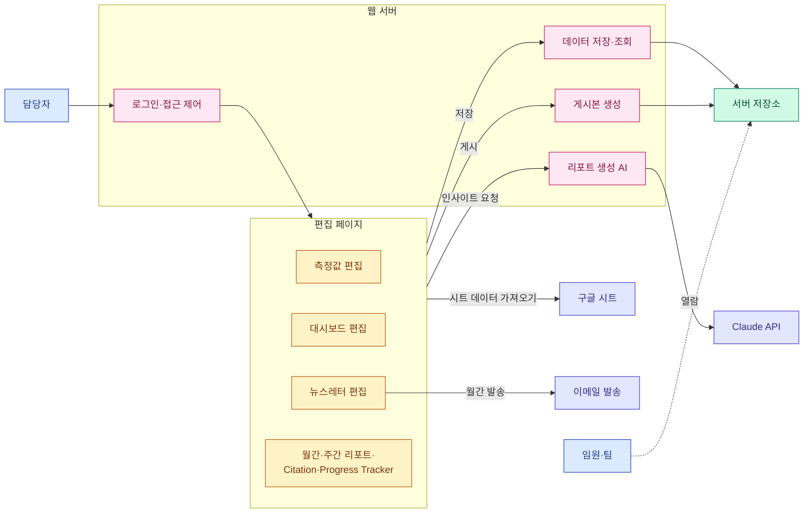
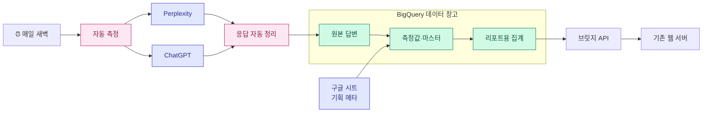
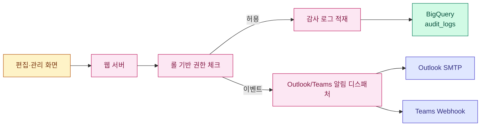

# GEO 리포팅 시스템 기획서

작성 2026-04-24

이 문서는 **현행 구조를 간략히 설명하고, 향후 어떻게 개선하여 최종적으로 리포트 생성 에이전트화로 나아갈지**를 정리한다.

---

## 1. 개요

- LG전자 해외영업본부 D2C 마케팅팀의 **GEO(Generative Engine Optimization) 리포팅 시스템**
- ChatGPT·Perplexity 등 생성형 AI에서의 LG 제품 노출을 측정 → **월간 뉴스레터 + 임원 대시보드** 발행
- 현재는 운영자(PIC) 1명이 전 과정을 수동으로 수행
- 향후 방향: **데이터 수집 자동화 → AI 근거 기반 생성 → 최종 에이전트화**

**문서 구조**

| 장 | 내용 |
|---|---|
| §2 | 현행 시스템 (간략) + 코드 품질 리뷰 + 보안 점검 |
| §3 | 향후 개선 방향 — 기능 축 (6개) |
| §4 | 향후 개선 방향 — 코드·보안 축 |
| §5 | 최종 비전 — 에이전트화된 시스템 |
| §6 | 로드맵 |
| §7 | 리스크 |

---

## 2. 현행 시스템 (As-Is)

### 2.1 한 장 도식



### 2.2 핵심 기능 목록

| 기능 | 설명 |
|---|---|
| 편집 페이지 7종 | 측정값·대시보드·뉴스레터·Citation·월간/주간 리포트·Progress Tracker |
| 구글 시트 동기화 | 19개 탭을 수동 트리거로 당겨와 파싱 |
| 게시 | KO/EN HTML을 고정 URL로 공개 (IP 화이트리스트) |
| 이메일 발송 | 월간 뉴스레터를 SMTP로 수동 발송 |
| AI 인사이트 | Claude API로 본문 초안 생성 (과거 발행본 12건 참고) |
| 운영 도구 | IP 관리·AI 설정·Archives·프롬프트 예시·기획서 뷰어 |

### 2.3 현행 한계 (기능 관점)

| 영역 | 한계 | 결과 |
|---|---|---|
| 데이터 수집 | 시트 수기 입력 + 수동 동기화 | 담당자 공수 월 수 시간 |
| 저장 | 서버 디스크 JSON 파일 | 이력·검색·집계 불가 |
| AI 생성 | 단발 호출, 수치 검증 없음 | 환각·오류 수동 교정 필요 |
| 관찰성 | 로그 수준 기록 | 비용·품질 추적 불가 |
| 프롬프트 관리 | 시트 + 몇몇 화면에 분산 | 버전·승인 체계 없음 |
| 지식 활용 | 과거 본문 raw 투입 | 토큰 낭비 + 일관성 부족 |
| Progress Tracker | 수동 과제 등록 | 신규 콘텐츠 누락 가능 |

### 2.4 코드 품질 리뷰 — 안드레이 카파시 관점 (비판적)

카파시 스타일의 렌즈: **minimalism · 순수 함수 분리 · 테스트 가능성 · 관찰성 · "agent는 tool use·loop·self-critique 중 하나 이상"** 기준으로 현행을 평가한다.

**핵심 판단**
> "This is not an agent. It's a single-shot LLM wrapper embedded in a 90-line Express handler."

**개선 항목 점수표** (심각도·영향·난이도 각 1~5, 점수 = 심각도 × 영향 ÷ 난이도, 클수록 우선 개선)

| # | 항목 | 이슈 요약 | 심각도 | 영향 | 난이도 | 점수 | 우선 |
|---|---|---|---:|---:|---:|---:|:---:|
| C1 | 에이전트성 결여 | `/api/generate-insight`는 단발 `messages.create` 래퍼. tool use·retry·self-critique 전무 | 5 | 5 | 3 | 8.3 | 🔴 |
| C2 | 라우트 핸들러 거대화 | 90~150줄 핸들러에 매핑·마스킹·프롬프트·호출·에러 모두 인라인 | 4 | 4 | 2 | 8.0 | 🔴 |
| C3 | 프롬프트 인젝션 무방어 | 시트 `data`를 system에 직접 interpolation. `<untrusted_data>` 경계 없음 | 5 | 4 | 2 | 10.0 | 🔴 |
| C4 | 관찰성 부재 | `console.log` 수준. token/latency/cost/finish_reason 미기록 | 4 | 5 | 2 | 10.0 | 🔴 |
| C5 | 프롬프트 버전 관리 | 프롬프트가 JS 템플릿 리터럴에 박힘. diff·롤백 불가 | 3 | 4 | 2 | 6.0 | 🟠 |
| C6 | 매직 넘버/문자열 | `12`(archive), `3`(examples), `TTL`, `'Audio'` 등 상수 미분리 | 3 | 3 | 1 | 9.0 | 🔴 |
| C7 | 정규식 휴리스틱 | `pct`·`maskNumbers`·`sanitizeHtml` 정규식이 엣지에 취약 | 4 | 4 | 3 | 5.3 | 🟠 |
| C8 | 순수 함수/I-O 혼재 | `readAiSettings`·`readArchives`·`writeFileSync`가 핸들러 안에 섞임 → 테스트 불가 | 4 | 3 | 3 | 4.0 | 🟠 |
| C9 | 타입 안전성 0 | JS only. `req.body` 즉시 destructure, 스키마 검증 없음 | 3 | 4 | 4 | 3.0 | 🟡 |
| C10 | 테스트 부재 | unit·integration 모두 0. 회귀 안전망 없음 | 4 | 4 | 4 | 4.0 | 🟠 |
| C11 | 거대 단일 파일 | `server.js` ~1,600줄, `excelUtils.js` ~1,600줄 | 3 | 3 | 3 | 3.0 | 🟡 |
| C12 | SSR + 클라이언트 JS 문자열 혼재 | `dashboardTemplate.js`가 서버 렌더 HTML과 브라우저 JS 문자열을 한 파일에서 조립 → 디버깅 어려움 | 4 | 4 | 4 | 4.0 | 🟠 |
| C13 | 에러 핸들링 단일 레이어 | try/catch/console.error만. 재시도·알림·분류 없음 | 3 | 4 | 2 | 6.0 | 🟠 |
| C14 | 의존 관리 취약 | `xlsx-js-style` dynamic+static 혼용으로 vite 경고. `npm audit` 루틴 부재 | 2 | 3 | 1 | 6.0 | 🟠 |
| C15 | 상태 관리 분산 | visibility editor의 state + Sidebar의 `extra`가 느슨하게 결합, `dashOnlyKeys` 같은 수동 목록 유지 | 3 | 4 | 3 | 4.0 | 🟡 |
| C16 | stale 데이터 경고 부재 | sync-data가 24h 이상 오래돼도 UI에 표시 없음 | 3 | 3 | 1 | 9.0 | 🔴 |
| C17 | 번들 크기 미최적화 | 각 SPA가 1MB+ (gzip 450KB), 코드 스플릿 없음 | 2 | 3 | 3 | 2.0 | 🟡 |
| C18 | 마이그레이션 경로 부재 | JSON 파일 저장이라 스키마 변경 시 수동 리라이트 | 3 | 3 | 2 | 4.5 | 🟠 |

우선 순위 요약 (점수 7 이상, 🔴 표시 5건 + 🟠 고영향 2건):
- **C3** 프롬프트 인젝션 방어 (10.0)
- **C4** 관찰성 (10.0)
- **C6** 매직 넘버 분리 (9.0)
- **C16** stale 경고 (9.0)
- **C1** 에이전트성 (8.3)
- **C2** 핸들러 분해 (8.0)

### 2.5 보안 취약점 점검 (별도)

| # | 항목 | 현재 상태 | 위험 | 권고 |
|---|---|---|---|---|
| S1 | **프롬프트 인젝션** | 시트 `data`를 system prompt에 직접 삽입 | 🔴 High | `<untrusted_data>` 래퍼 + 지시 무시 명시 + 결과 재검증 |
| S2 | **HTML Sanitize** | `sanitizeHtml`이 정규식 기반 (`<script>`·`onX=` 제거) | 🟠 Medium | `DOMPurify`·`sanitize-html` 같은 라이브러리 사용. `<iframe>`·`javascript:` URL·`<svg onload>` 등 커버 |
| S3 | **API 키 관리** | Anthropic API key가 env var에서 Anthropic 생성자로 직접 전달 | 🟠 Medium | GCP Secret Manager 이관 + 접근 감사 로그 |
| S4 | **Rate Limit** | `/api/auth/login`에만 적용 (5회/15분). 그 외 API 없음 | 🟠 Medium | `express-rate-limit` 전역 적용 (route별 차등) |
| S5 | **CSRF** | `X-Requested-With` 헤더만 확인 | 🟡 Low | `Origin`/`Referer` 화이트리스트 추가 |
| S6 | **IP 화이트리스트 우회** | `cf-connecting-ip`/`x-real-ip` 헤더 신뢰 | 🟡 Low | Render 앞단 프록시 구성에 따라 `req.ip`만 쓰는 모드 옵션화 (`TRUST_CF_HEADER` 환경변수로 제어) |
| S7 | **SSRF (gsheets-proxy)** | `docs.google.com`만 허용 | 🟢 OK | 유지. IPv4 literal 방어를 위해 DNS resolution 검증 추가 권고 |
| S8 | **정적 게시 HTML에 XSS 유입** | Sanitize는 서버에서 1회만 | 🟠 Medium | 게시 HTML에 CSP 헤더(`default-src 'self'; script-src 'none'` 등) 삽입 |
| S9 | **경로 traversal** | `/p/:slug`에 slug가 `../` 포함 가능성 | 🟡 Low | slug 정규식 `^[A-Za-z0-9_-]+$` 검증 추가 |
| S10 | **의존성 취약점** | `npm audit` 루틴 없음 | 🟠 Medium | CI에 `npm audit --audit-level=high` + Dependabot |
| S11 | **세션 저장소** | 메모리 `Set` — 서버 재시작 시 전원 로그아웃 | 🟡 Low | Redis/DB 세션 저장소 (멀티 인스턴스 대비) |
| S12 | **감사 로그** | 로그인 성공·실패만 로깅 | 🟠 Medium | 게시·프롬프트 변경·설정 변경 이벤트를 BigQuery `audit_logs`로 |
| S13 | **파일 권한** | 서버 프로세스가 `/data` 전체 쓰기 | 🟢 OK | 현 구조상 유지 |
| S14 | **환경변수 노출** | `/api/my-ip` 등이 debug 정보 반환 | 🟢 OK | 현재 민감 정보 없음, 향후 추가 시 주의 |
| S15 | **입력 크기 제한** | `express.json({ limit: '50mb' })` | 🟡 Low | DOS 방지 위해 라우트별 차등 (업로드는 큰 값, 일반 API는 1mb) |

요약: 🔴 1건 (S1), 🟠 6건 (S2/S3/S4/S8/S10/S12), 🟡 5건, 🟢 3건.
**최우선 조치: S1 프롬프트 인젝션 → §4.1의 P1 단계에서 해결**

---

## 3. 향후 개선 방향 — 기능 축 (6개)

| 축 | 목적 | 핵심 기술 |
|---|---|---|
| §3.1 데이터 파이프라인 자동화 | 수동 시트 입력 제거 | GCP (BigQuery, Cloud Run, Scheduler) |
| §3.2 프롬프트 관리·추출 통합 | 프롬프트를 단일 원천으로 버전 관리 | BigQuery 마스터 + 승인 워크플로 |
| §3.3 지식 허브 (RAG화) | 기존 뉴스레터·PIC 지식 활용 | 임베딩 + 벡터 검색 |
| §3.4 Progress Tracker 자동화 | 법인 사이트맵 기반 신규 콘텐츠 자동 트래킹 | 크롤러 + 리더빌리티 + 승인 UI |
| §3.5 리포트 생성 에이전트화 | 사실 조회·검증·자기 수정 + 생성 이력 관리 | Claude API 도구 호출 + 검증 루프 |
| §3.6 운영·거버넌스 | 권한·알림·감사 | 롤 기반 권한 + Outlook/Teams 알림 + 감사 로그 |

각 축의 상세는 아래.

---

### 3.1 데이터 파이프라인 자동화

**목적**: 담당자의 "시트 동기화" 단계를 폐지. 매일 새벽 자동 수집·정리·집계.

**구성**

| 구성 요소 | 역할 |
|---|---|
| 자동 스케줄러 | 매일 새벽 파이프라인 시작 |
| 프롬프트 러너 | Perplexity·ChatGPT에 측정 프롬프트 일괄 호출 |
| 응답 파서 | 인용·브랜드 언급·도메인 추출 |
| BigQuery 원본 | 엔진 답변 원본 보존 |
| BigQuery 팩트·차원 | 정제된 수치 + 제품·국가·토픽·프롬프트 마스터 |
| BigQuery 리포트 마트 | 대시보드용 일·주·월 집계 |
| 브릿지 API | BigQuery 집계 → 기존 sync-data JSON으로 변환 |
| **데이터 신선도 배지** | 각 편집 화면 상단에 "데이터 최신화: N시간 전" · "⚠️ 24시간 경과" 표시로 stale 방지 |



---

### 3.2 프롬프트 관리 및 추출 통합

**목적**: 분산된 프롬프트를 하나의 화면으로 묶고 BigQuery를 단일 원천으로.

| 기능 | 설명 |
|---|---|
| 목록·필터 | 국가/카테고리/토픽/CEJ/브랜드/활성 상태 다중 필터 |
| 조합별 추출 | (국가 × 카테고리 × 토픽 × CEJ) 조합당 대표 프롬프트 1개 |
| 편집·신규 | 프롬프트 본문·메타 수정 |
| 버전 관리 | 수정 시 version 증가, 이전 버전과 diff |
| 승인 워크플로 | Draft → Review → Active → Deprecated |
| 내보내기 | CSV / XLSX (스타일 포함) |
| 가져오기 | CSV/XLSX 일괄 업로드, dry-run 검증 후 반영 |

---

### 3.3 지식 허브 (기존 뉴스레터 + PIC 지식 RAG화)

**입력 자료**

| 종류 | 출처 |
|---|---|
| 기존 뉴스레터 본문 | archives.json + 신규 발행분 자동 수집 |
| PIC 메모 | 관리자 UI 업로드 (회의록·경쟁사 분석·고객 피드백) |
| 제품/시장 레퍼런스 | 사양서·조사 보고서·브랜드 가이드 업로드 |
| 과거 Q&A | 내부 해석 메모 |

**처리 파이프라인**

| 단계 | 동작 |
|---|---|
| ① 수집 | 업로드 또는 신규 발행분 자동 수집 |
| ② 분할 | 문단/섹션 단위 청킹 (300~500 토큰) |
| ③ 임베딩 | Vertex AI `text-embedding-005` |
| ④ 저장 | BigQuery + pgvector |
| ⑤ 메타 태깅 | country/product/topic/cej/period/source 자동 분류 (Claude 호출) |
| ⑥ 품질 검수 | 관리자 UI에서 잘못 태깅된 항목 수정 |

---

### 3.4 Progress Tracker 자동화

**목적**: 법인이 신규 생성한 콘텐츠를 자동으로 감지·품질 검수·트래킹 편입.

**동작**

| 단계 | 동작 |
|---|---|
| ① 사이트맵 수집 | 매주 월요일 새벽, 법인별 `sitemap.xml` 크롤 |
| ② 신규 URL 감지 | 저번 주 스냅샷 diff → 신규/변경/삭제 분류 |
| ③ 콘텐츠 추출 | 각 URL의 title·h1·본문 |
| ④ 리더빌리티 검수 | Flesch-Kincaid·평균 문장 길이·수동태 비율·전문용어 밀도 등 |
| ⑤ Claude 품질 보조 평가 | 명확성·구조·CTA 코멘트 |
| ⑥ 검토 큐 적재 | BigQuery `tracker_intake` |
| ⑦ 담당자 리뷰 | "Progress Tracker 대상?" 체크박스 UI |
| ⑧ 자동 등록 | 체크된 URL → 과제 목록에 편입, 법인·카테고리·게시일 자동 기입 |
| ⑨ 실적 입력 담당자 배정 | 법인별 **실적 입력 담당자**에게 자동 과제 할당 → 월간 실적 업데이트 의무화 |

```mermaid
flowchart LR
  classDef ext fill:#E0E7FF,stroke:#4338CA,color:#312E81
  classDef run fill:#FCE7F3,stroke:#BE185D,color:#831843
  classDef store fill:#D1FAE5,stroke:#047857,color:#064E3B
  classDef ui fill:#FEF3C7,stroke:#B45309,color:#78350F

  법인[법인 사이트맵<br/>US·DE·FR·UK·...]:::ext
  크롤[크롤러<br/>매주 월]:::run
  diff[신규 URL 감지]:::run
  추출[콘텐츠 추출]:::run
  가독[리더빌리티 검수]:::run
  품질[Claude 품질 평가]:::run
  큐[BigQuery tracker_intake]:::store
  UI[인테이크 큐 UI<br/>담당자 체크]:::ui
  PT[Progress Tracker<br/>과제 자동 등록]:::store

  법인 --> 크롤 --> diff --> 추출 --> 가독 --> 품질 --> 큐 --> UI
  UI -- 체크된 항목 --> PT
```



**실적 입력 담당자 롤**
- 법인별로 지정된 담당자에게 신규 과제가 자동 할당됨
- 담당자는 편집 화면에서 **자신에게 할당된 과제 목록**과 입력 상태(미입력·진행중·완료)를 본다
- 월간 입력 누락은 §3.6의 Outlook/Teams 알림으로 리마인드

---

### 3.5 리포트 생성 에이전트화 (Claude API)

**핵심 기법**

| 기법 | 효과 | Claude API 활용 |
|---|---|---|
| 도구 호출 (Function Calling) | 수치 환각 차단 | `messages.create`의 `tools`에 `get_metric`, `get_citation_top`, `search_knowledge`, `get_prompt_master` 정의 |
| RAG 주입 | 과거 발행본·지식 활용 | `search_knowledge` → Vector Search 결과를 user 메시지에 근거로 |
| 프롬프트 인젝션 방어 | 시트 데이터의 악의적 지시 무시 | `<untrusted_data>` 태그 + system 지시 |
| 수치 재검증 자동화 | 본문 수치 일치 확인 후 재생성 | 정규식 추출 → 도구 결과 대조 → 재호출 (최대 2회) |
| 관찰성 로그 | 비용·품질 수치 추적 | `usage.input_tokens`/`output_tokens`/latency/cost → BigQuery `logs.insight_runs` |
| 프롬프트 버전 관리 | A/B 평가·롤백 | `prompts/v{N}/` 디렉터리 + AI Settings 스위치 |
| **리포트 생성 이력 대시보드** | 호출 수·비용·retry율·성공률 시계열 추적 | `logs.insight_runs` 기반 Looker Studio 대시보드, 관리자 UI에서도 조회 |
| **섹션 잠금 (lock)** | 담당자가 완료한 섹션은 재생성 방지 | 잠금 해제 시 감사 로그 기록 (§3.6과 연동) |
| **다중 LLM 비교 (옵션)** | Claude·GPT·Gemini 응답을 나란히 (모델 선정·디버깅 목적) | `/admin/ai-settings`에서 비교 모드 활성화 시 병렬 호출 |

---

### 3.6 운영·거버넌스

**목적**: 누가 무엇을 할 수 있는지, 무엇이 언제 알려지고, 누가 언제 어떤 변경을 했는지를 체계화한다.

#### (1) 롤 기반 권한

| 롤 | 권한 |
|---|---|
| **Viewer (임원·열람자)** | 게시된 대시보드·뉴스레터 열람 |
| **Editor (마케터)** | 측정값·뉴스레터·대시보드 편집, AI 인사이트 생성 |
| **Approver (PM·팀장)** | Editor 권한 + 프롬프트 승인(`draft→active`), 뉴스레터 발송 승인 |
| **Tracker Contributor (실적 입력 담당자)** | 자신에게 할당된 Progress Tracker 과제만 실적 입력·조회 |
| **Admin** | 롤 관리·IP 화이트리스트·AI 설정·감사 로그 열람 |

권한은 `audit_logs`에 모든 액션을 기록한다 (§3.6-(3)).

#### (2) Outlook/Teams 기반 알림

기존 `Outlook/Teams` 언급을 모두 제거하고, **Microsoft 365 환경 (Outlook·Teams)** 기반 알림으로 통합.

| 알림 경로 | 사용처 | 구현 |
|---|---|---|
| **Outlook 이메일** | 월간 초안 준비 완료, 예산 초과, 보안 이상, 뉴스레터 발송 실패 | SMTP → Exchange Online |
| **Microsoft Teams 채널 카드** | 자동 수집 실패, 엔진 응답 편차, Progress Tracker 실적 입력 리마인드 | **Teams Incoming Webhook** (Adaptive Card JSON POST) |
| **개인 Teams 챗** | 실적 입력 담당자에게 과제 할당 알림 | Graph API (차후 단계) |

운영 시나리오 예:
- 매월 1일 06:00 — 월간 초안 완료 → 담당자 Outlook + Approver Teams 채널
- 주간 금요일 17:00 — 실적 미입력 과제 있는 담당자에게 Teams 리마인드
- 이벤트 — LLM 비용 상한 80%/100% 도달 → Admin Teams 채널 경고

#### (3) 감사 로그 뷰어 (최근 1,000건)

| 속성 | 설명 |
|---|---|
| 저장 | BigQuery `logs.audit_logs` (append-only) |
| 기록 대상 | 로그인·로그아웃, 프롬프트·롤·AI 설정·IP 화이트리스트 변경, 게시·발송, 섹션 잠금/해제, Archives 수정 |
| 필드 | `ts`, `user`, `action`, `target_id`, `before` / `after` (JSON), `ip`, `user_agent` |
| UI | `/admin/audit` — **최근 1,000건** 테이블 (사용자·액션·대상·시각 필터) |
| 내보내기 | CSV/XLSX 다운로드 |
| 보존 | BigQuery 장기 저장 90일 + Cloud Storage 아카이브 1년 |



---

## 4. 향후 개선 방향 — 코드·보안 축 (신규)

§2.4~2.5의 점수화 결과를 토대로, **기능과 별개로** 코드 품질·보안을 개선하는 전용 축을 둔다.

### 4.1 코드 개선 프로그램

| # | 개선 항목 | 원인 이슈 | 우선 | 예상 공수 |
|---|---|---|:---:|---|
| K1 | 라우트 핸들러 분해 (`buildSystemPrompt`, `maskNumbers`, `callClaude` 순수 함수화) | C2·C8 | 🔴 | 3일 |
| K2 | 프롬프트 파일 분리 (`prompts/v{N}/`) + 버전 스위치 | C5 | 🔴 | 2일 |
| K3 | `<untrusted_data>` 경계 도입 | C3 / S1 | 🔴 | 0.5일 |
| K4 | 관찰성 로그 `logs.insight_runs` + Looker Studio 대시보드 | C4 | 🔴 | 3일 |
| K5 | 상수 파일 (`src/shared/constants.runtime.ts`): archive slice, 제품 UL 코드, 국가 세트 등 | C6 | 🔴 | 1일 |
| K6 | 단위 테스트 도입 (Vitest): parseAppendix·maskNumbers·pctOrNull·cntyLabel | C10 | 🟠 | 4일 |
| K7 | Integration 테스트 (supertest): `/api/publish`, `/api/generate-insight` | C10 | 🟠 | 3일 |
| K8 | Zod 스키마 검증 (`req.body`·`/api/*/sync-data`) | C9 | 🟠 | 2일 |
| K9 | 타입 전환 (TypeScript) 점진적 도입: `src/shared/*` → `server.js` → editors | C9 | 🟠 | 10일 |
| K10 | `dashboardTemplate.js` 분리: SSR 모듈(`ssr.js`), 클라이언트 JS(`client.js`), 스타일(`styles.css`) | C12 | 🟠 | 5일 |
| K11 | 거대 파일 리팩터: `server.js` → 라우트 모듈로 분리 (`routes/auth.js`, `routes/publish.js` …) | C11 | 🟡 | 5일 |
| K12 | `withFileLock` 대신 SQLite/Redis: 파일 락의 원자성 한계 제거 | C13 | 🟡 | 4일 |
| K13 | 로깅 프레임워크 (`pino`) 도입, 요청 상관관계 ID 전파 | C4·C13 | 🟠 | 2일 |
| K14 | stale sync-data 경고 배지 (UI) | C16 | 🔴 | 0.5일 |
| K15 | 번들 코드 스플릿 (xlsx dynamic import 일원화) | C17 | 🟡 | 1일 |
| K16 | 의존성 정책: `npm audit --audit-level=high` CI + Dependabot | C14 | 🟠 | 0.5일 |
| K17 | CI 파이프라인 (GitHub Actions): lint·test·build·audit | — | 🟠 | 2일 |

### 4.2 보안 강화 프로그램

| # | 개선 항목 | 대응 이슈 | 우선 | 예상 공수 |
|---|---|---|:---:|---|
| SEC1 | `<untrusted_data>` 래퍼 + 결과 재검증 | S1 | 🔴 | K3과 동일 |
| SEC2 | `sanitize-html` 라이브러리 교체 + CSP 헤더 | S2·S8 | 🟠 | 1일 |
| SEC3 | GCP Secret Manager로 API 키 이관 + 접근 감사 | S3 | 🟠 | 2일 |
| SEC4 | `express-rate-limit` 전역 적용 (route별 임계값) | S4 | 🟠 | 1일 |
| SEC5 | Origin/Referer 화이트리스트 CSRF 보강 | S5 | 🟡 | 0.5일 |
| SEC6 | `TRUST_CF_HEADER` 환경변수로 헤더 신뢰 선택 (프록시 구성에 맞춤) | S6 | 🟡 | 0.5일 |
| SEC7 | `/p/:slug` 경로 traversal 정규식 검증 | S9 | 🟡 | 0.2일 |
| SEC8 | `audit_logs` 이벤트: 게시·프롬프트 변경·설정 변경 | S12 | 🟠 | 2일 |
| SEC9 | 세션 저장소 Redis 이관 (멀티 인스턴스 대비) | S11 | 🟡 | 2일 |
| SEC10 | 라우트별 `express.json` 크기 차등 | S15 | 🟡 | 0.5일 |
| SEC11 | `npm audit` CI + 주간 Dependabot PR | S10 | 🟠 | K16 포함 |

### 4.3 아키텍처 전환 (장기)

| 항목 | 현재 | 장기 목표 |
|---|---|---|
| 런타임 | Render 단일 Node.js | Cloud Run + 자동 스케일 + 멀티 리전 |
| 저장소 | 디스크 JSON | BigQuery + Cloud Storage(원본·청크) |
| 세션 | 메모리 Set | Redis (Memorystore) |
| 빌드 | 수동 `npm run build` → Render | GitHub Actions → Artifact Registry → Cloud Run |
| 구성 관리 | 환경변수 산재 | Secret Manager + Terraform |
| 언어 | JS | 점진적 TS (shared → server → editors) |
| 모니터링 | Render 기본 로그 | Cloud Monitoring + Outlook/Teams 알림 + Looker Studio |

---

## 5. 최종 비전 — 에이전트화된 시스템

5개 기능 축과 코드·보안 축이 모두 완성되면 시스템은 다음과 같이 동작한다.

### 5.1 에이전트 루프

```mermaid
flowchart TD
  classDef auto fill:#D1FAE5,stroke:#047857,color:#064E3B
  classDef agent fill:#FCE7F3,stroke:#BE185D,color:#831843
  classDef human fill:#FEF3C7,stroke:#B45309,color:#78350F

  시작[⏰ 매월 1일 새벽]:::auto

  수집[① 자동 수집<br/>BigQuery 갱신]:::auto
  의도[② 의도 판정<br/>섹션별 분해]:::agent
  지식[③ 지식 허브 검색<br/>search_knowledge]:::agent
  수치[④ 수치 조회<br/>get_metric]:::agent
  생성[⑤ 섹션별 본문 생성<br/>Claude API]:::agent
  검증[⑥ 수치 재검증]:::agent
  초안[⑦ 뉴스레터 초안 저장]:::auto
  알림[⑧ 담당자 알림 (Outlook/Teams)]:::auto

  검토[⑨ 담당자 검토·미세 편집]:::human
  승인[⑩ 승인 + 발송 예약]:::human

  시작 --> 수집 --> 의도 --> 지식 --> 수치 --> 생성 --> 검증
  검증 -- 일치 --> 초안
  검증 -- 불일치 --> 생성
  초안 --> 알림 --> 검토 --> 승인
```

### 5.2 인간 개입 지점

| 지점 | 담당자가 하는 일 | 빈도 |
|---|---|---|
| Progress Tracker 인테이크 | 신규 URL이 트래킹 대상인지 체크 | 매주 10분 |
| Progress Tracker 실적 입력 | 할당된 과제의 월간 실적 기입 | 월 1회 (법인 담당자) |
| 프롬프트 관리 | 신규 프롬프트 승인·수정 | 월 1회 15분 |
| 지식 허브 | 메모 업로드 + 잘못 태깅된 청크 교정 | 수시 |
| 월간 초안 검토 | 자동 생성된 뉴스레터 읽고 승인 | 월 1회 15~20분 |
| 감사 로그 확인 | 최근 1,000건 이상 이벤트 점검 | 월 1회 |
| 이상 알림 대응 | 엔진 응답 이상·비용 초과 (Outlook/Teams 수신) | 이벤트 발생 시 |

### 5.3 기대 효과

| 지표 | As-Is | To-Be |
|---|---|---|
| 월간 뉴스레터 생성 공수 | 수 시간 | 15~20분 |
| 데이터 최신성 | 수동 주 1회 | 자동 매일 |
| AI 수치 오류율 | 수 % | 1% 미만 |
| 신규 콘텐츠 누락 | 발생 | 0건 |
| 프롬프트 이력 추적 | 불가 | 전체 버전+사유 기록 |
| 리포트 근거 추적 | 수동 | 각 문장마다 참조 청크 링크 |
| 핸들러 평균 라인 수 | 90~150 | 20 미만 |
| 테스트 커버리지 | 0% | 60% 이상 (핵심 파서·API) |
| 보안 취약점 🔴🟠 | 7건 | 0건 |

---

## 6. 로드맵

**기능 축 + 코드·보안 축 병렬 진행**

| 단계 | 기간 | 기능 산출물 | 코드·보안 산출물 |
|---|---|---|---|
| P0 | — | 본 기획서 | — |
| P1 | 1주 | — | K3·K4·K14·SEC1 (인젝션·관찰성·stale) |
| P2 | 2주 | GCP 기초 세팅 | K5·K16·K17 (상수·CI·audit) |
| P3 | 3주 | 데이터 자동 수집 MVP | K1·K2 (핸들러 분해·프롬프트 버전) |
| P4 | 2주 | 브릿지 연동 | K6·K8 (단위 테스트·Zod) |
| P5 | 2주 | 프롬프트 관리 통합 + **롤 기반 권한 1차** | K7·SEC4 (integration·rate limit) |
| P6 | 3주 | 지식 허브 RAG + **Outlook/Teams 알림 디스패처** | K10·SEC2·SEC8 (템플릿 분리·CSP·감사 로그) |
| P7 | 3주 | Progress Tracker 자동화 + **실적 입력 담당자 롤** | K9 (TS 도입 1차) |
| P8 | 3주 | 에이전트화 (도구·검증) + **리포트 생성 이력 대시보드**·**섹션 잠금** | K11·SEC3 (server.js 분리·Secret Manager) |
| P9 | 2주 | 월간 자동 초안 + **감사 로그 뷰어 (1,000건)** | K12·SEC9 (Redis 이관) |
| P10 | 2주 | 최종 루프 통합 + **다중 LLM 비교 (옵션)** | K13·전면 검증 |

---

## 7. 리스크

| 구분 | 위험 | 완화 |
|---|---|---|
| 보안 | API 키 유출 | Secret Manager + 감사 로그 |
| 보안 | 프롬프트 인젝션 | untrusted 래퍼 + 결과 재검증 |
| 품질 | AI 수치 환각 | 도구 호출 강제 + 수치 재검증 |
| 품질 | 지식 허브 오분류 | 담당자 수동 검수 |
| 품질 | 사이트맵 누락 | 다중 소스 크롤 + 404 모니터링 |
| 비용 | LLM·크롤 호출 급증 | 예산 알림 + 월 상한 + RAG 토큰 절감 |
| 신뢰 | 엔진 응답 변동 | 다중 엔진 저장 + 편차 알림 |
| 정합성 | 시트 수기 ↔ 자동 수집 충돌 | `dim_prompt.source` 컬럼 구분 |
| 마이그레이션 | JSON → BigQuery 전환 중 이중 진실 | 브릿지 API로 단일 공급원 유지 |
| 조직 | 담당자 온보딩 저항 | Before/After 비교 + 30분 교육 |

---

## 8. 부록 — 소스 파일

| 파일 | 역할 |
|---|---|
| `server.js` | 웹 서버 (라우팅·인증·게시·Claude API 호출·관리자 UI) |
| `src/excelUtils.js` | 구글 시트 19개 탭 파서 |
| `src/shared/insightPrompts.js` | 섹션별 Claude 프롬프트 빌더 |
| `src/shared/api.js` | 편집 페이지용 API 래퍼 |
| `src/dashboard/dashboardTemplate.js` | 임원 대시보드 템플릿 |
| `src/emailTemplate.js` | 월간 뉴스레터 이메일 템플릿 |
| `src/visibility/App.jsx` 등 | 편집 페이지 루트 |
| `docs/ADMIN_PLAN.md` | 이 문서 |

---

*문서 버전 v9.0 · 2026-04-24*
