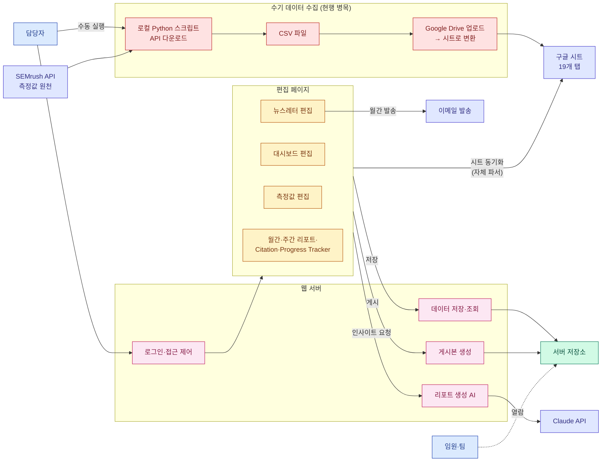
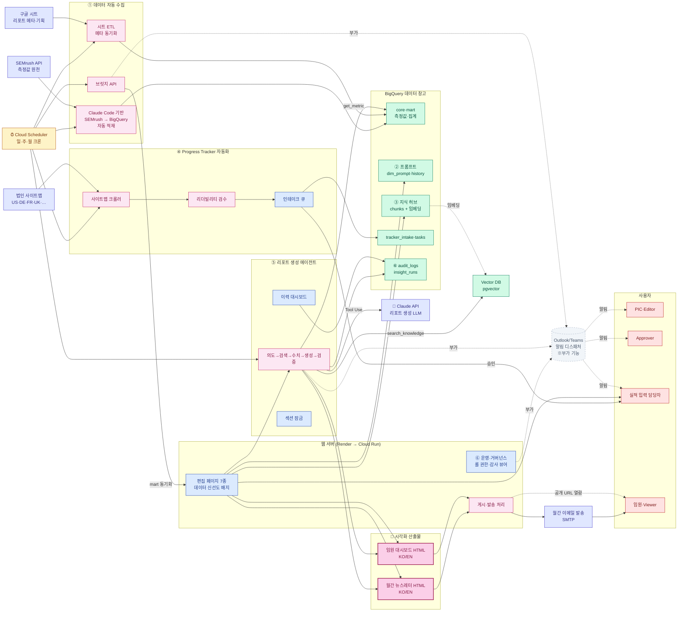
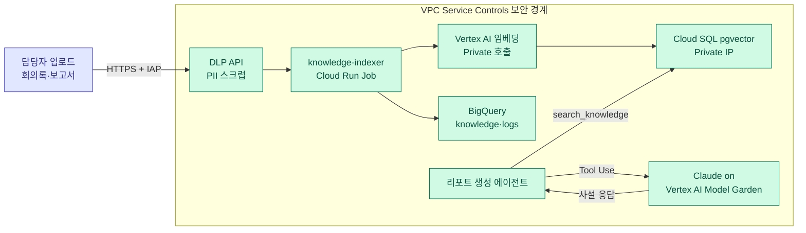
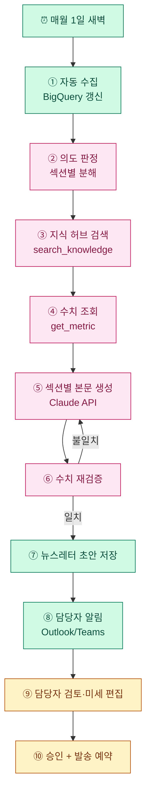

# GEO 리포팅 시스템 기획서

작성 2026-04-24

이 문서는 **현행 구조를 간략히 설명하고, 향후 어떻게 개선하여 최종적으로 리포트 생성 에이전트화로 나아갈지**를 정리한다.

**문서 구조**

| 장 | 내용 |
|---|---|
| §1 | 개요 |
| §2 | 현행 시스템 (간략) |
| §3 | To-Be 아키텍처 (한 장) |
| §4 | To-Be 기능 (6개 축) |
| §5 | 최종 비전 — 에이전트화된 시스템 |
| §6 | 로드맵 |
| §7 | 리스크 |
| Appendix | 코드 품질 리뷰·보안 점검·코드/보안 개선 프로그램·아키텍처 전환·소스 파일 |

---

## 1. 개요

- LG전자 해외영업본부 D2C 마케팅팀의 **GEO(Generative Engine Optimization) 리포팅 시스템**
- ChatGPT·Perplexity 등 생성형 AI에서의 LG 제품 노출을 측정 → **월간 뉴스레터 + 임원 대시보드** 발행
- 현재는 운영자(PIC) 1명이 전 과정을 수동으로 수행
- 향후 방향: **데이터 수집 자동화 → AI 근거 기반 생성 → 최종 에이전트화**

---

## 2. 현행 시스템 (As-Is)

### 2.1 한 장 도식

**현행 데이터 수집 단계** (붉은 박스 = 수기 병목)
1. PIC가 로컬 Python 스크립트로 **SEMrush API**를 호출해 측정값 다운로드
2. 결과를 **CSV로 저장**
3. **Google Drive에 업로드**하여 구글 시트로 변환
4. 편집 페이지가 시트의 19개 탭을 자체 파서로 동기화

### 2.2 핵심 기능 목록

| 기능 | 설명 |
|---|---|
| **SEMrush 데이터 수집 (수기)** | PIC가 로컬 Python으로 SEMrush API 호출 → CSV → Google Drive → 구글 시트 |
| 편집 페이지 7종 | 측정값·대시보드·뉴스레터·Citation·월간/주간 리포트·Progress Tracker |
| 구글 시트 동기화 | 19개 탭을 자체 파서로 당겨와 정형 데이터화 |
| 게시 | KO/EN HTML을 고정 URL로 공개 (IP 화이트리스트) |
| 이메일 발송 | 월간 뉴스레터를 SMTP로 수동 발송 |
| AI 인사이트 | Claude API로 본문 초안 생성 (과거 발행본 12건 참고) |
| 운영 도구 | IP 관리·AI 설정·Archives·프롬프트 예시·기획서 뷰어 |

### 2.3 현행 한계

| 영역 | 한계 | 결과 |
|---|---|---|
| **SEMrush 수집** | 로컬 Python 수동 실행 → CSV → Drive 업로드 (4단계 수기) | 매주 수십 분, 누락·오류 위험 |
| 데이터 저장 | 서버 디스크 JSON 파일 | 이력·검색·집계 불가 |
| AI 생성 | 단발 호출, 수치 검증 없음 | 환각·오류 수동 교정 필요 |
| 관찰성 | 로그 수준 기록 | 비용·품질 추적 불가 |
| 프롬프트 관리 | 시트 + 몇몇 화면에 분산 | 버전·승인 체계 없음 |
| 지식 활용 | 과거 본문 raw 투입 | 토큰 낭비 + 일관성 부족 |
| Progress Tracker | 수동 과제 등록 | 신규 콘텐츠 누락 가능 |

> 코드 품질·보안 상세 진단은 **Appendix A/B** 참고.

---

## 3. To-Be 아키텍처 (한 장)

6개 기능 축이 통합 완료됐을 때의 전체 그림. **LLM은 Claude API만 사용**한다 (다른 엔진 호출·교차 검증 없음).

**도식 읽는 법**
- ①~⑥: §4 기능 축 번호
- **메인 흐름** (왼쪽 → 오른쪽): SEMrush·구글 시트·사이트맵 → 데이터 창고(BigQuery) → 에이전트(Claude API) → **시각화 산출물(뉴스레터·대시보드)** → 임원 열람
- **시각화 산출물**(분홍 굵은 선): 동일한 BigQuery 데이터에서 같은 에이전트가 **뉴스레터 HTML과 대시보드 HTML을 일관되게 동시 생성** — 톤·수치·근거가 두 채널에서 일치
- **LLM 호출은 Claude API 단일** — 측정 엔진 호출이나 모델 교차 검증 없음
- **Outlook/Teams 알림**은 점선·회색의 **부가 기능** — 메인 데이터 흐름과는 분리

### 3.1 As-Is vs To-Be 차이 정리

| 항목 | As-Is (현행) | To-Be (목표) |
|---|---|---|
| **측정값 수집** | SEMrush API → 로컬 Python → CSV → Drive 업로드 → 시트 (4단계 수기) | Claude Code 기반 `semrush-loader`가 BigQuery에 직접 적재 (자동) |
| **데이터 동기화** | PIC가 편집 화면에서 "동기화" 클릭 | Cloud Scheduler 매일 새벽 자동, "데이터 신선도 배지"로 상태 표시 |
| **데이터 저장소** | Render 디스크 JSON 파일 (검색·집계 불가) | BigQuery 단일 원천 (이력·검색·집계·Looker 시각화) |
| **구글 시트 역할** | 모든 측정값·메타·프롬프트 보관 (혼합) | 메타·기획 정보로 한정, 측정값은 SEMrush 자동 적재 |
| **LLM 사용** | Claude API 단발 호출 (래퍼) | Claude API 단일 + 도구 호출(Tool Use) + 수치 재검증 루프 |
| **수치 정확성** | 환각 발생 시 PIC가 수동 교정 | `get_metric` 도구로 BigQuery 직접 조회, 불일치 시 자동 재생성 |
| **과거 발행본 활용** | 12건 전문을 프롬프트에 통째 삽입 | RAG (지식 허브) — 의미 유사 청크 3~5개만 검색 주입 |
| **담당자 암묵지·보고서** | 시스템 외부에 흩어짐 (개인 메모·드라이브·메일) | 지식 허브에 업로드·임베딩, `search_knowledge` 도구로 활용 |
| **프롬프트 관리** | `Appendix.Prompt List` 시트 + 분산 화면 | BigQuery 마스터(version·status) + 통합 관리 UI |
| **Progress Tracker** | 수동 과제 등록 | 사이트맵 자동 크롤 → 리더빌리티 검수 → 인테이크 큐 → 실적 입력 담당자 자동 배정 |
| **권한** | 단일 PIC 비밀번호 | 5개 롤 (Viewer·Editor·Approver·Tracker Contributor·Admin) |
| **알림** | 없음 (수동 확인) | Outlook 이메일 + Teams 채널 (부가 기능) |
| **뉴스레터·대시보드** | 별도 편집 화면, 수동 정합성 점검 | 동일 BigQuery + 동일 에이전트로 동시 생성, 톤·수치 자동 일치 |
| **뉴스레터 발송** | 수동 SMTP 발송 | 월간 자동 초안 → PIC 검토·승인 → 발송 예약 |
| **관찰성** | console.log 수준 | BigQuery `logs.insight_runs` + Looker Studio 대시보드 |
| **감사** | 로그인만 기록 | `audit_logs` 게시·프롬프트·롤·설정 변경 전체, 관리자 UI 1,000건 뷰어 |
| **보안** | 정규식 sanitize, 인젝션 무방어 | sanitize-html + CSP, `<untrusted_data>` 래퍼, Secret Manager |
| **인프라** | Render 단일 인스턴스 ($7/월) | GCP (Cloud Run + BigQuery + Cloud SQL) ($55~120/월) |
| **LLM 비용** | 통제 불가 | Claude API 월 $20~50 (Budget Alert $300 상한) |
| **PIC 월간 공수** | 수 시간 | 15~20분 (자동 초안 검토·승인 중심) |
| **신규 콘텐츠 누락** | 발생 | 0건 (사이트맵 기반 자동 인테이크) |

### 3.2 인프라 결론

- **LLM은 Claude API 단일** — 다른 엔진 호출·교차 검증 없음. 리포트 생성·메타 태깅·품질 평가에 모두 Claude만 사용
- **측정값 수집을 Claude Code로 전면 자동화** — 기존 4단계 수기(Python 다운로드 → CSV → Drive → 시트)를 Claude Code 기반 작업으로 교체해 **SEMrush API → BigQuery 직접 적재**. 별도 레포 [`mts8787-droid/dashboard-raw-data`](https://github.com/mts8787-droid/dashboard-raw-data.git)에 이미 구현된 적재 스크립트를 재사용·확장
- **구글 시트는 메타·기획 정보로 한정** — 리포트 제목·기간·기획 메모 등은 시트에서 ETL, 측정값은 SEMrush 자동 적재 경로로 이원화
- **GCP를 데이터·AI 기반**으로 삼고, 기존 **Render 웹 서버는 단계적으로 Cloud Run**으로 이전. 전환 기간에는 브릿지 API로 공존
- 데이터·지식·프롬프트·감사 로그를 모두 **BigQuery 단일 원천**에 통합
- **뉴스레터와 대시보드는 동일한 BigQuery 데이터 + 동일한 에이전트**로 생성되어, 두 산출물의 톤·수치·근거가 자동 일치
- **Outlook/Teams 알림**은 메인 흐름과 분리된 **부가 기능** (이상 탐지·완료 통지)
- 고정 인프라 비용은 **월 $55~120**, Claude API 호출은 **월 $20~50** 수준 (예산 알림 필수)
- 세부는 `docs/GCP_INFRA.md` / `/admin/infra` 참조

---

## 4. To-Be 기능 (6개 축)

| 번호 | 축 | 목적 | 핵심 기술 |
|---|---|---|---|
| ① | §4.1 데이터 파이프라인 자동화 | 수동 시트 입력 제거 | GCP (BigQuery, Cloud Run, Scheduler) |
| ② | §4.2 프롬프트 관리·추출 통합 | 프롬프트를 단일 원천으로 버전 관리 | BigQuery 마스터 + 승인 워크플로 |
| ③ | §4.3 지식 허브 (RAG) | 기존 뉴스레터·PIC 지식 활용 | 임베딩 + 벡터 검색 |
| ④ | §4.4 Progress Tracker 자동화 | 법인 사이트맵 기반 신규 콘텐츠 자동 트래킹 | 크롤러 + 리더빌리티 + 승인 UI |
| ⑤ | §4.5 리포트 생성 에이전트화 | 사실 조회·검증·자기 수정 + 이력 관리 | Claude API 도구 호출 + 검증 루프 |
| ⑥ | §4.6 운영·거버넌스 | 권한·알림·감사 | 롤 기반 권한 + Outlook/Teams + 감사 로그 |

---

### 4.1 데이터 파이프라인 자동화

**목적**: 현재 4단계 수기 흐름(Python → CSV → Drive → 시트)을 폐지하고, **Claude Code 기반 작업**으로 SEMrush API에서 BigQuery까지 자동 적재한다. 시트 동기화 클릭도 사라지고, 모든 데이터가 BigQuery에 누적되어 이력·검색·집계가 가능해진다.

> 시스템 내부에서 사용하는 LLM은 **Claude API 하나**뿐이다 (리포트 생성·메타 태깅·품질 평가 모두).

**구성**

| 구성 요소 | 역할 |
|---|---|
| 자동 스케줄러 | 매일 새벽 데이터 적재 트리거 (Cloud Scheduler) |
| **Claude Code 기반 SEMrush 적재** | SEMrush API 호출 → 정규화 → BigQuery 직접 적재. 별도 레포 [`dashboard-raw-data`](https://github.com/mts8787-droid/dashboard-raw-data.git)의 구현을 재사용 |
| 시트 ETL (메타 전용) | 구글 시트의 메타·기획 탭만 읽어 BigQuery `meta_*` 테이블 갱신 (측정값 시트는 To-Be에서 제외) |
| BigQuery 팩트·차원 | SEMrush 적재 결과 + 시트 메타가 합쳐진 측정값·제품·국가·토픽·프롬프트 마스터 |
| BigQuery 리포트 마트 | 뉴스레터·대시보드용 일·주·월 집계 (Scheduled Query) |
| 브릿지 API | BigQuery 마트 → 기존 sync-data JSON 형식으로 변환해 웹 서버에 전달 |
| **데이터 신선도 배지** | 각 편집 화면 상단에 "데이터 최신화: N시간 전"·"⚠️ 24시간 경과" 표시 |

**기존 레포 활용**
- [`mts8787-droid/dashboard-raw-data`](https://github.com/mts8787-droid/dashboard-raw-data.git) — 이미 Claude Code로 BigQuery 적재 파이프라인이 구현되어 있음. 이 레포의 적재 로직을 본 인프라의 Cloud Run Job(`semrush-loader`)으로 컨테이너화해 운영 환경에 통합한다.

---

### 4.2 프롬프트 관리 및 추출 통합

**목적**: 분산된 프롬프트를 한 화면으로 묶고 BigQuery를 단일 원천으로.

| 기능 | 설명 |
|---|---|
| 목록·필터 | 국가/카테고리/토픽/CEJ/브랜드/활성 상태 다중 필터 |
| 조합별 추출 | (국가 × 카테고리 × 토픽 × CEJ) 조합당 대표 프롬프트 1개 |
| 편집·신규 | 프롬프트 본문·메타 수정 |
| 버전 관리 | 수정 시 version 증가, 이전 버전과 diff |
| 승인 워크플로 | Draft → Review → Active → Deprecated |
| 내보내기 | CSV / XLSX (스타일 포함) |
| 가져오기 | CSV/XLSX 일괄 업로드, dry-run 검증 후 반영 |

**BigQuery 스키마**

| 테이블 | 역할 |
|---|---|
| `dim_prompt` | 활성 버전 마스터 |
| `dim_prompt_history` | 모든 수정 이력 (append-only) |

---

### 4.3 지식 허브 (기존 뉴스레터 + 담당자 암묵지·보고서 RAG화)

**입력 자료**

| 종류 | 출처 |
|---|---|
| 기존 뉴스레터 본문 | archives.json + 신규 발행분 자동 수집 |
| **담당자 암묵지** | 회의록·구두 인사이트·내부 채팅 정리 메모 등 그동안 문서화되지 못한 지식 |
| **공식 보고서** | 월간·분기 GEO 보고서, 경쟁사 분석, 고객 피드백 보고서, 시장 조사 |
| 제품/시장 레퍼런스 | 사양서·브랜드 가이드·캠페인 자료 |
| 과거 Q&A | 내부 해석 메모 ("왜 DE RAC가 Q2에 상승했나" 등) |

**처리 파이프라인**

| 단계 | 동작 |
|---|---|
| ① 수집 | 업로드 또는 신규 발행분 자동 수집 |
| ② 분할 | 문단·섹션 단위 청킹 (300~500 토큰) |
| ③ 임베딩 | Vertex AI `text-embedding-005` |
| ④ 저장 | BigQuery + pgvector |
| ⑤ 메타 태깅 | country/product/topic/cej/period/source 자동 분류 (Claude) |
| ⑥ 품질 검수 | 관리자 UI에서 잘못 태깅된 항목 수정 |

**검색·주입**

| 단계 | 동작 |
|---|---|
| ① 인사이트 요청 | 섹션별 "인사이트 생성" 클릭 |
| ② 컨텍스트 추출 | 제품·국가·기간 자동 추출 |
| ③ 벡터 검색 | 유사도 Top-K (K=5) |
| ④ 메타 필터 | country/product 일치 우선 |
| ⑤ Claude 주입 | `search_knowledge` 도구 호출 결과를 user 메시지에 근거로 삽입 |
| ⑥ 근거 표시 | 생성 본문 옆에 참조 청크 각주 |

#### 폐쇄 환경 운영 방안

담당자 암묵지·보고서에는 사내 민감 정보가 포함되므로, 지식 허브와 RAG 검색 전 과정이 **사외로 데이터를 송신하지 않는 폐쇄 환경**에서 작동해야 한다. 다음 4개 레이어로 구현한다.

| 레이어 | 구성 | 설명 |
|---|---|---|
| **L1 네트워크 격리** | VPC Service Controls + Private Service Connect | BigQuery·Cloud SQL·Vertex AI·Secret Manager를 보안 경계(perimeter)에 가두어, 경계 외부로의 데이터 송신을 차단. 모든 GCP 서비스 호출은 사설 IP로만 통신 |
| **L2 임베딩 사내화** | Vertex AI 임베딩 모델을 **VPC 내부에서만** 호출 (Private Google Access) | 임베딩 입력 텍스트가 공인 인터넷을 거치지 않음. 더 강한 폐쇄가 필요하면 GCE/GKE 위에 오픈소스 임베딩 모델(BGE-large·E5-large) 직접 호스팅 |
| **L3 LLM 호출 경로** | **Claude on Vertex AI Model Garden** 사용 | Anthropic 서버 직접 호출 대신, GCP가 중계하는 Claude 엔드포인트를 사용해 데이터가 GCP 보안 경계 안에서만 흐름. 같은 프로젝트 IAM·VPC-SC가 적용됨 |
| **L4 데이터 분류·마스킹** | DLP API + 업로드 시 자동 PII 스크럽 | 업로드 문서에서 개인정보·회사 기밀 라벨 자동 검출, 임베딩 전 마스킹 (선택) |

**구성 도식**

**선택 가능 옵션**

| 옵션 | 적용 효과 | 트레이드오프 |
|---|---|---|
| Vertex AI 임베딩 + VPC-SC | GCP 관리형, 설정 간단 | 임베딩 모델은 Google이 운영 (Anthropic·OpenAI보다 사외 노출 적음) |
| 자체 호스팅 임베딩 (BGE/E5 on GKE/GCE) | 모델 가중치까지 사내 통제, 외부 의존 0 | GPU 인프라·운영 비용 증가, 모델 업그레이드 자체 책임 |
| Claude on Vertex AI | 데이터가 GCP 경계 안에서만 흐름 | Anthropic 직접 SDK 대비 일부 기능 시차, 호출당 단가 약간 다름 |
| DLP 자동 마스킹 | PII·기밀 라벨 자동 검출·차단 | False positive 시 정상 문서도 차단될 수 있음 — 검수 큐 필요 |

**권장 도입 순서**

1. **P6 단계** (지식 허브 RAG 도입)에 **Vertex AI 임베딩 + VPC-SC + Private Cloud SQL**을 기본 폐쇄 구성으로 적용
2. **P8 단계** (에이전트화)에 **Claude on Vertex AI Model Garden**으로 LLM 경로도 폐쇄 경계 안에 포함
3. PII 민감도가 높은 보고서가 들어오기 시작하면 **DLP API 자동 마스킹** 단계 추가
4. 사내 보안 정책이 더 엄격해지면 **자체 호스팅 임베딩**으로 마이그레이션

---

### 4.4 Progress Tracker 자동화

**동작**

| 단계 | 동작 |
|---|---|
| ① 사이트맵 수집 | 매주 월요일 새벽, 법인별 `sitemap.xml` 크롤 |
| ② 신규 URL 감지 | 저번 주 스냅샷과 diff → 신규/변경/삭제 분류 |
| ③ 콘텐츠 추출 | 각 URL의 title·h1·본문 |
| ④ 리더빌리티 검수 | Flesch-Kincaid·평균 문장 길이·수동태 비율·전문용어 밀도 |
| ⑤ Claude 품질 보조 평가 | 명확성·구조·CTA 코멘트 |
| ⑥ 검토 큐 적재 | BigQuery `tracker_intake` |
| ⑦ 담당자 리뷰 | "Progress Tracker 대상?" 체크박스 UI |
| ⑧ 자동 등록 | 체크된 URL → 과제 목록에 편입, 법인·카테고리·게시일 기입 |
| ⑨ 실적 입력 담당자 배정 | 법인별 **실적 입력 담당자**에게 자동 과제 할당 |

**실적 입력 담당자 롤**
- 법인별로 지정된 담당자에게 신규 과제가 자동 할당
- 담당자는 자신에게 할당된 과제 목록과 상태(미입력·진행중·완료)를 본다
- 월간 입력 누락은 §4.6의 Outlook/Teams 알림으로 리마인드

---

### 4.5 리포트 생성 에이전트화 (Claude API)

| 기법 | 효과 | Claude API 활용 |
|---|---|---|
| 도구 호출 (Function Calling) | 수치 환각 차단 | `messages.create`의 `tools`에 `get_metric`, `get_citation_top`, `search_knowledge`, `get_prompt_master` 정의 |
| RAG 주입 | 과거 발행본·지식 활용 | `search_knowledge` → Vector Search 결과를 user 메시지에 근거로 |
| 프롬프트 인젝션 방어 | 시트 데이터의 악의적 지시 무시 | `<untrusted_data>` 태그 + system 지시 |
| 수치 재검증 자동화 | 본문 수치 일치 확인 후 재생성 | 정규식 추출 → 도구 결과 대조 → 재호출 (최대 2회) |
| 관찰성 로그 | 비용·품질 수치 추적 | `usage.input_tokens`/`output_tokens`/latency/cost → BigQuery `logs.insight_runs` |
| 프롬프트 버전 관리 | A/B 평가·롤백 | `prompts/v{N}/` 디렉터리 + AI Settings 스위치 |
| **리포트 생성 이력 대시보드** | 호출 수·비용·retry율·성공률 시계열 | `logs.insight_runs` 기반 Looker Studio + 관리자 UI |
| **섹션 잠금 (lock)** | 담당자가 완료한 섹션은 재생성 방지 | 잠금 해제 시 감사 로그 기록 |

---

### 4.6 운영·거버넌스

**목적**: 누가 무엇을 할 수 있는지, 무엇이 언제 알려지고, 누가 언제 어떤 변경을 했는지를 체계화.

#### (1) 롤 기반 권한

| 롤 | 권한 |
|---|---|
| **Viewer (임원·열람자)** | 게시된 대시보드·뉴스레터 열람 |
| **Editor (마케터)** | 측정값·뉴스레터·대시보드 편집, AI 인사이트 생성 |
| **Approver (PM·팀장)** | Editor 권한 + 프롬프트 승인, 뉴스레터 발송 승인 |
| **Tracker Contributor (실적 입력 담당자)** | 자신에게 할당된 Progress Tracker 과제만 실적 입력·조회 |
| **Admin** | 롤 관리·IP 화이트리스트·AI 설정·감사 로그 열람 |

#### (2) Outlook/Teams 기반 알림

Microsoft 365 환경 기반. Slack은 사용하지 않음.

| 알림 경로 | 사용처 | 구현 |
|---|---|---|
| **Outlook 이메일** | 월간 초안 준비 완료, 예산 초과, 보안 이상, 뉴스레터 발송 실패 | SMTP → Exchange Online |
| **Microsoft Teams 채널 카드** | 자동 수집 실패, 엔진 응답 편차, Progress Tracker 실적 입력 리마인드 | Teams Incoming Webhook (Adaptive Card JSON) |
| **개인 Teams 챗** | 실적 입력 담당자에게 과제 할당 알림 | Graph API (차후) |

#### (3) 감사 로그 뷰어 (최근 1,000건)

| 속성 | 설명 |
|---|---|
| 저장 | BigQuery `logs.audit_logs` (append-only) |
| 기록 대상 | 로그인·로그아웃, 프롬프트·롤·AI 설정·IP 화이트리스트 변경, 게시·발송, 섹션 잠금/해제, Archives 수정 |
| 필드 | `ts`, `user`, `action`, `target_id`, `before`/`after`(JSON), `ip`, `user_agent` |
| UI | `/admin/audit` — 최근 **1,000건** 테이블 (사용자·액션·대상·시각 필터) |
| 내보내기 | CSV/XLSX |
| 보존 | BigQuery 90일 + Cloud Storage 아카이브 1년 |

---

## 5. 최종 비전 — 에이전트화된 시스템

### 5.1 에이전트 루프

### 5.2 인간 개입 지점

| 지점 | 담당자가 하는 일 | 빈도 |
|---|---|---|
| Progress Tracker 인테이크 | 신규 URL이 트래킹 대상인지 체크 | 매주 10분 |
| Progress Tracker 실적 입력 | 할당된 과제의 월간 실적 기입 | 월 1회 (법인 담당자) |
| 프롬프트 관리 | 신규 프롬프트 승인·수정 | 월 1회 15분 |
| 지식 허브 | 메모 업로드 + 잘못 태깅된 청크 교정 | 수시 |
| 월간 초안 검토 | 자동 생성된 뉴스레터 읽고 승인 | 월 1회 15~20분 |
| 감사 로그 확인 | 최근 1,000건 이상 이벤트 점검 | 월 1회 |
| 이상 알림 대응 | 엔진 응답 이상·비용 초과 (Outlook/Teams 수신) | 이벤트 발생 시 |

### 5.3 기대 효과

| 지표 | As-Is | To-Be |
|---|---|---|
| 월간 뉴스레터 생성 공수 | 수 시간 | 15~20분 |
| 데이터 최신성 | 수동 주 1회 | 자동 매일 |
| AI 수치 오류율 | 수 % | 1% 미만 |
| 신규 콘텐츠 누락 | 발생 | 0건 |
| 프롬프트 이력 추적 | 불가 | 전체 버전+사유 기록 |
| 리포트 근거 추적 | 수동 | 각 문장마다 참조 청크 링크 |
| 핸들러 평균 라인 수 | 90~150 | 20 미만 |
| 테스트 커버리지 | 0% | 60% 이상 |
| 보안 취약점 🔴🟠 | 7건 | 0건 |

---

## 6. 로드맵

**기능 축 + 코드·보안 축 병렬 진행**

| 단계 | 기간 | 기능 산출물 | 코드·보안 산출물 |
|---|---|---|---|
| P0 | — | 본 기획서 | — |
| P1 | 1주 | — | K3·K4·K14·SEC1 (인젝션·관찰성·stale) |
| P2 | 2주 | GCP 기초 세팅 | K5·K16·K17 (상수·CI·audit) |
| P3 | 3주 | 데이터 자동 수집 MVP | K1·K2 (핸들러 분해·프롬프트 버전) |
| P4 | 2주 | 브릿지 연동 | K6·K8 (단위 테스트·Zod) |
| P5 | 2주 | 프롬프트 관리 통합 + **롤 기반 권한 1차** | K7·SEC4 (integration·rate limit) |
| P6 | 3주 | 지식 허브 RAG + **Outlook/Teams 알림 디스패처** | K10·SEC2·SEC8 (템플릿 분리·CSP·감사 로그) |
| P7 | 3주 | Progress Tracker 자동화 + **실적 입력 담당자 롤** | K9 (TS 도입 1차) |
| P8 | 3주 | 에이전트화 (도구·검증) + **이력 대시보드**·**섹션 잠금** | K11·SEC3 (server.js 분리·Secret Manager) |
| P9 | 2주 | 월간 자동 초안 + **감사 로그 뷰어 (1,000건)** | K12·SEC9 (Redis 이관) |
| P10 | 2주 | 최종 루프 통합 | K13·전면 검증 |

---

## 7. 리스크

| 구분 | 위험 | 완화 |
|---|---|---|
| 보안 | API 키 유출 | Secret Manager + 감사 로그 |
| 보안 | 프롬프트 인젝션 | untrusted 래퍼 + 결과 재검증 |
| 품질 | AI 수치 환각 | 도구 호출 강제 + 수치 재검증 |
| 품질 | 지식 허브 오분류 | 담당자 수동 검수 |
| 품질 | 사이트맵 누락 | 다중 소스 크롤 + 404 모니터링 |
| 비용 | LLM·크롤 호출 급증 | 예산 알림 + 월 상한 + RAG 토큰 절감 |
| 신뢰 | 엔진 응답 변동 | 다중 엔진 저장 + 편차 알림 |
| 정합성 | 시트 수기 ↔ 자동 수집 충돌 | `dim_prompt.source` 컬럼 구분 |
| 마이그레이션 | JSON → BigQuery 전환 중 이중 진실 | 브릿지 API로 단일 공급원 유지 |
| 조직 | 담당자 온보딩 저항 | Before/After 비교 + 30분 교육 |

---

# Appendix

## A. 코드 품질 리뷰 — 안드레이 카파시 관점

**판단 요약**
> "This is not an agent. It's a single-shot LLM wrapper embedded in a 90-line Express handler."

**점수표** (심각도 × 영향 ÷ 난이도, 클수록 우선)

| # | 항목 | 이슈 요약 | 심각도 | 영향 | 난이도 | 점수 | 우선 |
|---|---|---|---:|---:|---:|---:|:---:|
| C1 | 에이전트성 결여 | `/api/generate-insight`는 단발 래퍼. tool use·retry·self-critique 전무 | 5 | 5 | 3 | 8.3 | 🔴 |
| C2 | 라우트 핸들러 거대화 | 90~150줄 핸들러에 매핑·마스킹·프롬프트·호출·에러 모두 인라인 | 4 | 4 | 2 | 8.0 | 🔴 |
| C3 | 프롬프트 인젝션 무방어 | 시트 `data`를 system에 직접 interpolation | 5 | 4 | 2 | 10.0 | 🔴 |
| C4 | 관찰성 부재 | `console.log` 수준. token/latency/cost 미기록 | 4 | 5 | 2 | 10.0 | 🔴 |
| C5 | 프롬프트 버전 관리 | JS 템플릿 리터럴. diff·롤백 불가 | 3 | 4 | 2 | 6.0 | 🟠 |
| C6 | 매직 넘버/문자열 | `12`·`3`·`TTL`·`Audio` 등 상수 미분리 | 3 | 3 | 1 | 9.0 | 🔴 |
| C7 | 정규식 휴리스틱 | `pct`·`maskNumbers`·`sanitizeHtml` | 4 | 4 | 3 | 5.3 | 🟠 |
| C8 | 순수 함수/I-O 혼재 | readAiSettings·writeFileSync가 핸들러 안 | 4 | 3 | 3 | 4.0 | 🟠 |
| C9 | 타입 안전성 0 | JS only. `req.body` 즉시 destructure | 3 | 4 | 4 | 3.0 | 🟡 |
| C10 | 테스트 부재 | unit·integration 모두 0 | 4 | 4 | 4 | 4.0 | 🟠 |
| C11 | 거대 단일 파일 | `server.js` ~1,600줄 | 3 | 3 | 3 | 3.0 | 🟡 |
| C12 | SSR + 클라이언트 JS 혼재 | `dashboardTemplate.js` | 4 | 4 | 4 | 4.0 | 🟠 |
| C13 | 에러 핸들링 단일 레이어 | try/catch/console.error | 3 | 4 | 2 | 6.0 | 🟠 |
| C14 | 의존 관리 취약 | `xlsx-js-style` dynamic+static 혼용, `npm audit` 부재 | 2 | 3 | 1 | 6.0 | 🟠 |
| C15 | 상태 관리 분산 | `dashOnlyKeys` 수동 목록 | 3 | 4 | 3 | 4.0 | 🟡 |
| C16 | stale 데이터 경고 부재 | sync-data 24h+ 경고 없음 | 3 | 3 | 1 | 9.0 | 🔴 |
| C17 | 번들 크기 미최적화 | 각 SPA 1MB+ | 2 | 3 | 3 | 2.0 | 🟡 |
| C18 | 마이그레이션 경로 부재 | JSON 파일 저장 | 3 | 3 | 2 | 4.5 | 🟠 |

우선: **C3(10.0)·C4(10.0)·C6(9.0)·C16(9.0)·C1(8.3)·C2(8.0)**

---

## B. 보안 취약점 점검

| # | 항목 | 현재 상태 | 위험 | 권고 |
|---|---|---|---|---|
| S1 | 프롬프트 인젝션 | 시트 `data`를 system prompt에 직접 | 🔴 High | `<untrusted_data>` 래퍼 + 결과 재검증 |
| S2 | HTML Sanitize | 정규식 기반 (`<script>`·`onX=` 제거) | 🟠 Medium | `DOMPurify`·`sanitize-html` 라이브러리 |
| S3 | API 키 관리 | env var 직접 전달 | 🟠 Medium | Secret Manager 이관 + 감사 |
| S4 | Rate Limit | `/api/auth/login`만 | 🟠 Medium | `express-rate-limit` 전역 |
| S5 | CSRF | `X-Requested-With`만 | 🟡 Low | Origin/Referer 화이트리스트 |
| S6 | IP 화이트리스트 우회 | CF/x-real-ip 신뢰 | 🟡 Low | `TRUST_CF_HEADER` 옵션 |
| S7 | SSRF (gsheets-proxy) | docs.google.com만 허용 | 🟢 OK | DNS resolution 검증 추가 |
| S8 | 정적 HTML XSS | 서버 1회 sanitize | 🟠 Medium | 게시 HTML에 CSP 헤더 |
| S9 | 경로 traversal | `/p/:slug` 검증 부족 | 🟡 Low | `^[A-Za-z0-9_-]+$` 검증 |
| S10 | 의존성 취약점 | `npm audit` 루틴 없음 | 🟠 Medium | CI + Dependabot |
| S11 | 세션 저장소 | 메모리 Set | 🟡 Low | Redis |
| S12 | 감사 로그 | 로그인만 | 🟠 Medium | 게시·프롬프트·설정 이벤트 |
| S13 | 파일 권한 | `/data` 전체 쓰기 | 🟢 OK | 유지 |
| S14 | 환경변수 노출 | 민감 정보 없음 | 🟢 OK | 향후 주의 |
| S15 | 입력 크기 제한 | 전역 50mb | 🟡 Low | 라우트별 차등 |

요약: 🔴 1 · 🟠 6 · 🟡 5 · 🟢 3

---

## C. 코드 개선 프로그램

| # | 개선 항목 | 원인 | 우선 | 공수 |
|---|---|---|:---:|---|
| K1 | 라우트 핸들러 분해 (`buildSystemPrompt`·`maskNumbers`·`callClaude` 순수 함수화) | C2·C8 | 🔴 | 3일 |
| K2 | 프롬프트 파일 분리 (`prompts/v{N}/`) + 버전 스위치 | C5 | 🔴 | 2일 |
| K3 | `<untrusted_data>` 경계 도입 | C3 / S1 | 🔴 | 0.5일 |
| K4 | 관찰성 로그 `logs.insight_runs` + Looker Studio | C4 | 🔴 | 3일 |
| K5 | 상수 파일 (`constants.runtime.ts`) | C6 | 🔴 | 1일 |
| K6 | 단위 테스트 (Vitest) | C10 | 🟠 | 4일 |
| K7 | Integration 테스트 (supertest) | C10 | 🟠 | 3일 |
| K8 | Zod 스키마 검증 (`req.body`·sync-data) | C9 | 🟠 | 2일 |
| K9 | 타입 전환 (TypeScript) 점진 도입 | C9 | 🟠 | 10일 |
| K10 | `dashboardTemplate.js` 분리 (`ssr.js`·`client.js`·`styles.css`) | C12 | 🟠 | 5일 |
| K11 | `server.js` → 라우트 모듈로 분리 | C11 | 🟡 | 5일 |
| K12 | `withFileLock` → SQLite/Redis | C13 | 🟡 | 4일 |
| K13 | 로깅 프레임워크 (`pino`) + 상관관계 ID | C4·C13 | 🟠 | 2일 |
| K14 | stale sync-data 경고 배지 UI | C16 | 🔴 | 0.5일 |
| K15 | 번들 코드 스플릿 (xlsx dynamic 일원화) | C17 | 🟡 | 1일 |
| K16 | `npm audit --audit-level=high` CI + Dependabot | C14 | 🟠 | 0.5일 |
| K17 | CI 파이프라인 (GitHub Actions): lint·test·build·audit | — | 🟠 | 2일 |

---

## D. 보안 강화 프로그램

| # | 개선 항목 | 대응 | 우선 | 공수 |
|---|---|---|:---:|---|
| SEC1 | `<untrusted_data>` 래퍼 + 결과 재검증 | S1 | 🔴 | K3과 동일 |
| SEC2 | `sanitize-html` 라이브러리 + CSP 헤더 | S2·S8 | 🟠 | 1일 |
| SEC3 | GCP Secret Manager + 접근 감사 | S3 | 🟠 | 2일 |
| SEC4 | `express-rate-limit` 전역 | S4 | 🟠 | 1일 |
| SEC5 | Origin/Referer 화이트리스트 CSRF 보강 | S5 | 🟡 | 0.5일 |
| SEC6 | `TRUST_CF_HEADER` 환경변수로 헤더 신뢰 선택 | S6 | 🟡 | 0.5일 |
| SEC7 | `/p/:slug` 경로 traversal 정규식 | S9 | 🟡 | 0.2일 |
| SEC8 | `audit_logs` 이벤트 적재 | S12 | 🟠 | 2일 |
| SEC9 | 세션 저장소 Redis 이관 | S11 | 🟡 | 2일 |
| SEC10 | 라우트별 `express.json` 크기 차등 | S15 | 🟡 | 0.5일 |
| SEC11 | `npm audit` CI + 주간 Dependabot PR | S10 | 🟠 | K16 포함 |

---

## E. 아키텍처 전환 (장기)

| 항목 | 현재 | 장기 목표 |
|---|---|---|
| 런타임 | Render 단일 Node.js | Cloud Run + 자동 스케일 |
| 저장소 | 디스크 JSON | BigQuery + Cloud Storage |
| 세션 | 메모리 Set | Redis (Memorystore) |
| 빌드 | 수동 → Render | GitHub Actions → Artifact Registry → Cloud Run |
| 구성 관리 | 환경변수 산재 | Secret Manager + Terraform |
| 언어 | JS | 점진적 TS |
| 모니터링 | Render 기본 로그 | Cloud Monitoring + Outlook/Teams 알림 + Looker Studio |

---

## F. 소스 파일

| 파일 | 역할 |
|---|---|
| `server.js` | 웹 서버 (라우팅·인증·게시·Claude API 호출·관리자 UI) |
| `src/excelUtils.js` | 구글 시트 19개 탭 파서 |
| `src/shared/insightPrompts.js` | 섹션별 Claude 프롬프트 빌더 |
| `src/shared/api.js` | 편집 페이지용 API 래퍼 |
| `src/dashboard/dashboardTemplate.js` | 임원 대시보드 템플릿 |
| `src/emailTemplate.js` | 월간 뉴스레터 이메일 템플릿 |
| `src/visibility/App.jsx` 등 | 편집 페이지 루트 |
| `docs/ADMIN_PLAN.md` | 이 문서 |
| `docs/GCP_INFRA.md` | GCP 인프라 구성도 (`/admin/infra`) |
| [`mts8787-droid/dashboard-raw-data`](https://github.com/mts8787-droid/dashboard-raw-data.git) | **별도 레포** — Claude Code 기반 SEMrush API → BigQuery 적재 (To-Be 데이터 파이프라인 핵심) |

---

*문서 버전 v15.0 · 2026-04-25*
