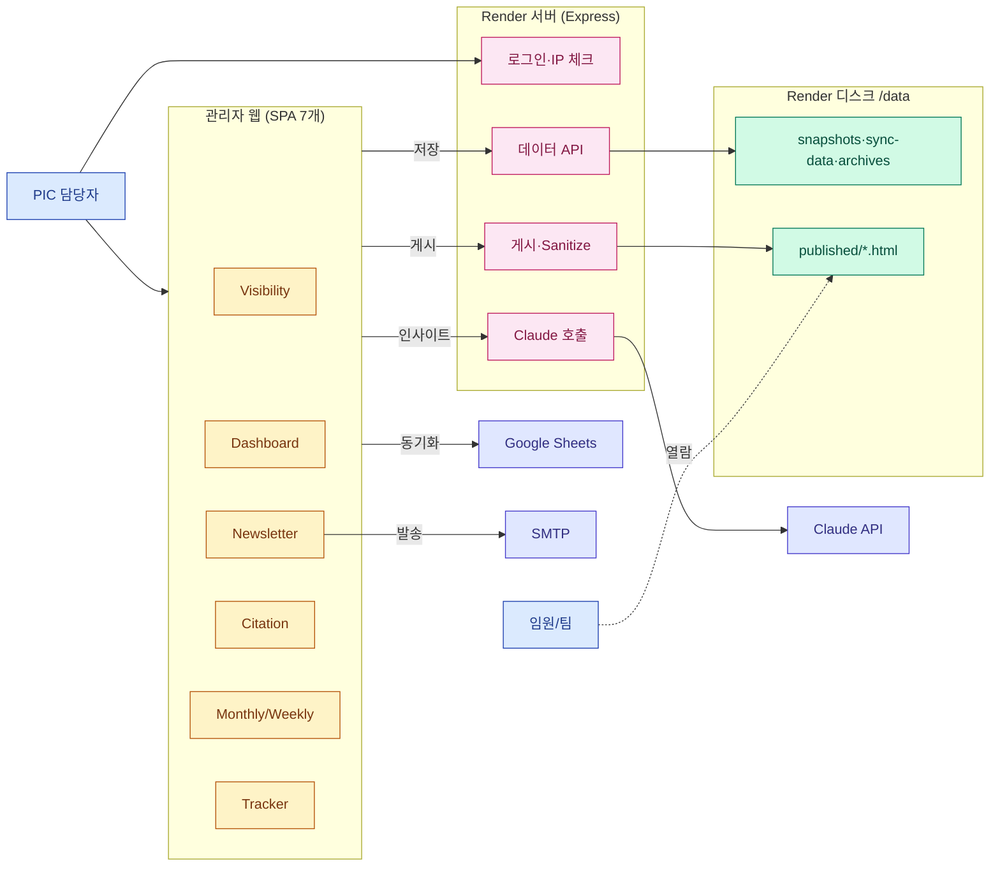
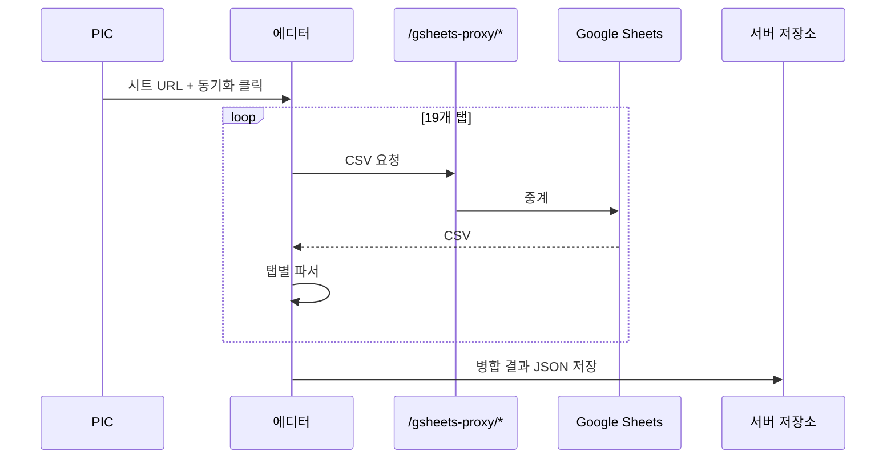
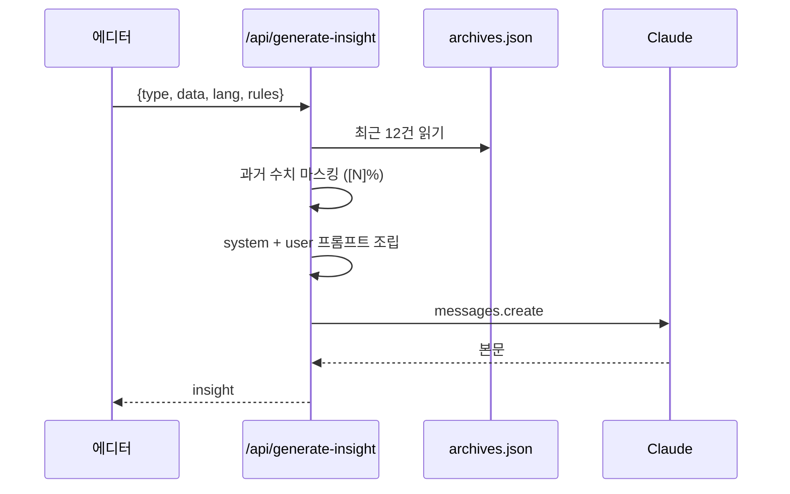

# GEO 뉴스레터 시스템 기획서

작성 2026-04-24

## 1. 개요

- LG전자 해외영업본부 D2C 마케팅팀이 운영하는 **GEO(Generative Engine Optimization) 리포팅 시스템**
- ChatGPT·Perplexity 같은 생성형 AI에서 LG 제품이 얼마나 노출되는지 측정 → 매주 뉴스레터 + 임원 대시보드로 공유
- 운영자(PIC) 1명이 Google Sheets 데이터를 웹 에디터로 불러와 편집·AI 초안 작성·게시·발송하는 흐름

**산출물 3종**

| 산출물 | 수신자 | 주기 | 형태 |
|---|---|---|---|
| 주간 뉴스레터 | 본부 임원·팀 | 매주 월요일 | 이메일 (KO/EN) |
| 통합 대시보드 | 임원 전체 | 수시 열람 | 웹페이지 |
| 월간/주간 리포트 | 담당자 | 주기적 | 웹페이지 |

---

## 2. 기능 정의

관리자 웹의 기능은 세 덩어리로 나뉜다.

### 2.1 리포트 편집 화면

| 에디터 | 역할 | 사용 빈도 |
|---|---|---|
| **Visibility Editor** | 제품·국가·주차별 점수 편집 + AI 인사이트 생성 | 주 1회 이상 |
| **Dashboard Editor** | 임원용 통합 대시보드 편집·게시 | 주 1회 이상 |
| **Newsletter Editor** | 주간 이메일 본문 조립·미리보기·발송 | 주 1회 |
| **Citation Editor** | 인용 도메인·페이지 타입 분석 | 주 1회 |
| **Monthly/Weekly Report** | 기간별 상세 리포트 | 주기적 |
| **Progress Tracker** | KPI 진척율 트래커 | 월 1~2회 |

공통으로 두 버튼이 있다.
- **동기화**: Google Sheets에서 데이터를 당겨와 파싱
- **게시**: 결과물을 고정 URL로 공개 (`/p/슬러그`)

### 2.2 운영 도구

| 메뉴 | 역할 | 사용 빈도 |
|---|---|---|
| **IP Access Manager** | 게시본 열람 허용 IP 대역 관리 | 초기 1회 |
| **AI Settings** | Claude 작성 규칙·모델·토큰 수 설정 | 월 1회 |
| **Archives** | 과거 발행본 보관 (AI 문체 학습용) | 수시 |
| **독일 프롬프트 예시** | DE 국가 논브랜드 프롬프트를 카테고리×토픽×CEJ 조합별로 1개씩 추출 + 엑셀 다운로드 | 필요 시 |
| **시스템 기획서** | 이 문서 뷰어 | — |

### 2.3 AI 인사이트 생성

- Visibility Editor의 각 섹션에 "인사이트 생성" 버튼 제공
- 서버가 Claude API를 호출해 본문 초안을 생성
- 과거 발행본 12건을 참고 예시로 함께 전달 (숫자는 `[N]%`로 마스킹해 옛 수치 복사 방지)
- 결과는 편집기에 즉시 반영, 재생성/수동 수정 가능

---

## 3. 아키텍처

### 3.1 전체 도식

### 3.2 구성 요소

| 계층 | 구성 | 비고 |
|---|---|---|
| **클라이언트** | React SPA 7개 (Vite 빌드) | `dist*` 디렉터리, 각자 독립 번들 |
| **서버** | Node.js + Express 단일 인스턴스 | `server.js` 약 1600줄 |
| **저장소** | Render 디스크 `/data` 마운트 (1 GB) | JSON 파일 + `published/*.html` |
| **배포** | Render Starter 플랜 | `render.yaml` |
| **인증** | 세션 쿠키 (httpOnly) + IP 화이트리스트 | `ADMIN_PASSWORD` 환경변수 |
| **외부 의존성** | Google Sheets, SMTP, Anthropic Claude | 모두 환경변수 주입 |

### 3.3 주요 서버 라우트

| 카테고리 | 경로 | 역할 |
|---|---|---|
| 인증 | `/admin/login`, `/api/auth/login`, `/api/auth/logout` | 세션 발급·폐기 |
| 프록시 | `/gsheets-proxy/*` | Google Sheets CSV 중계 (`docs.google.com`만 허용) |
| 동기화 | `/api/:mode/sync-data` | mode(visibility/dashboard/newsletter/citation/monthly-report/weekly-report)별 sync JSON |
| 스냅샷 | `/api/:mode/snapshots` | 수동 저장본 이력 |
| 게시 | `/api/publish`, `/api/publish-dashboard`, `/api/publish-citation` 등 | Sanitize 후 HTML 파일 저장 |
| AI | `/api/generate-insight` | Claude 호출 |
| 이메일 | `/api/send-email` | nodemailer 발송 |
| 관리자 UI | `/admin/`, `/admin/{ip-manager\|archives\|ai-settings\|de-prompts\|plan}` | 내장 HTML 페이지 |
| 에디터 정적 | `/admin/{visibility\|dashboard\|newsletter\|citation\|monthly-report\|weekly-report\|progress-tracker}` | `dist*` 정적 서빙 |
| 공개 열람 | `/p/:slug` | IP 화이트리스트 검증 후 HTML 반환 |

### 3.4 저장되는 파일

| 파일 패턴 | 내용 |
|---|---|
| `*-snapshots.json` | 모드별 저장본 이력 (최대 50건) |
| `*-sync-data.json` | 모드별 최신 동기화 상태 |
| `published/{slug}.html` | 게시된 KO/EN HTML |
| `publish-meta.json` | 게시 메타(제목·타임스탬프) |
| `archives.json` | AI 학습용 과거 발행본 |
| `ip-allowlist.json` | 허용 IP 대역 (CIDR) |
| `ai-settings.json` | 작성 규칙·모델·토큰 |

### 3.5 데이터 원천 — Google Sheets 19개 탭

| 그룹 | 탭 이름 |
|---|---|
| 메타 | `meta` |
| 월간 요약 | `Monthly Visibility Summary`, `Monthly Visibility Product_CNTY_{MS/HS/ES}` |
| 주간 트렌드 | `Weekly {MS/HS/ES} Visibility` |
| PR·프롬프트 | `Monthly/Weekly PR Visibility`, `Monthly/Weekly Brand Prompt Visibility` |
| Citation | `Citation-Page Type`, `Citation-Touch Points`, `Citation-Domain` |
| 부록 | `Appendix.Prompt List`, `unlaunched`, `PR Topic List` |

---

## 4. 데이터 플로우

### 4.1 주간 운영 1회전

| 단계 | 주체 | 동작 |
|---|---|---|
| ① | 마케팅팀 | ChatGPT·Perplexity 응답을 분석해 Google Sheets에 점수 입력 |
| ② | PIC | Visibility Editor 접속 → 시트 URL 붙여넣기 → 동기화 클릭 |
| ③ | 에디터 | 19개 탭 순회하며 CSV 받아 파서로 구조화 |
| ④ | 서버 | `/api/visibility/sync-data`에 JSON 저장 (파일 락 포함) |
| ⑤ | PIC | 섹션별 "인사이트 생성" 클릭, AI 본문을 다듬음 |
| ⑥ | PIC | Dashboard Editor에서 통합 게시 (KO+EN) |
| ⑦ | 서버 | 스크립트·이벤트 핸들러 제거 후 `/data/published/`에 저장 |
| ⑧ | PIC | Newsletter Editor에서 이메일 미리보기·발송 |
| ⑨ | 임원 | IP 화이트리스트 경유해 `/p/슬러그`로 열람 |
| ⑩ | 서버 | 다음 주 인사이트 생성 시 Archives를 문체 참고 자료로 재사용 |

### 4.2 시트 동기화 세부 흐름

### 4.3 AI 인사이트 생성 세부 흐름

---

## 5. 향후 방향

두 축으로 자동화·지능화를 추진한다.

### 5.1 축 ① — GCP 데이터 파이프라인 자동화

| 구성 요소 | 역할 |
|---|---|
| **Cloud Scheduler** | 매일 03:00 KST 파이프라인 트리거 |
| **Cloud Run Job — Prompt Runner** | Perplexity·ChatGPT에 프롬프트 일괄 실행 → 원본 저장 |
| **Cloud Run Job — Response Parser** | 응답에서 claim·citation·브랜드 언급 추출 |
| **BigQuery `raw` 레이어** | 엔진 응답 원본 보존 |
| **BigQuery `core` 레이어** | `fact_visibility`, `fact_citation`, `dim_*` (정제된 팩트+차원) |
| **BigQuery `mart` 레이어** | 리포트용 집계 (주간 트렌드·국가 총계·도메인 랭킹) |
| **Bridge API** `/api/ingest/sync-from-bq` | BigQuery mart → Render sync-data JSON 변환 (매일 04:00) |

도입 후 PIC의 "시트 동기화" 단계가 자동화되고, 기존 에디터·템플릿 코드는 변경 없이 최신 데이터를 쓴다.

### 5.2 축 ② — Claude 에이전트화

| 기법 | 효과 |
|---|---|
| **Tool Use (`get_metric`)** | 본문 수치를 BigQuery에서 직접 조회 → 환각 차단 |
| **RAG + 임베딩** | 과거 발행본 전체 대신 유사 문단 3~5개만 삽입 → 토큰 60% 절감 |
| **Prompt Injection 방어** | 데이터를 `<untrusted_data>` 래퍼로 감싸고 지시 무시 명시 |
| **Factual-Check Loop** | 생성 후 수치 재검증, 불일치 시 자동 재생성 (최대 2회) |
| **관찰성 (`logs.insight_runs`)** | 토큰·비용·지연·피드백을 BigQuery에 기록 → 버전별 A/B 평가 |
| **프롬프트 버전 관리** | `prompts/v{N}` 디렉터리 분리 + 골든 테스트 |
| **자동 초안 에이전트** | 매주 월 06:00 뉴스레터 초안 자동 생성 → PIC는 검토·승인만 (15분) |

### 5.3 로드맵 요약

| 단계 | 기간 | 주요 산출물 |
|---|---|---|
| P0 현행 | — | 기획서 확정 |
| P1 관찰성 + 인젝션 방어 | 1주 | `logs.insight_runs`, untrusted 래퍼 |
| P2 GCP 세팅 | 2주 | 프로젝트·BigQuery 스키마 |
| P3 Ingestion MVP | 3주 | Prompt Runner + Parser |
| P4 Bridge API | 2주 | 자동 동기화 운영 |
| P5 Tool Use + Factual-Check | 3주 | 수치 오류 < 1% |
| P6 RAG | 2주 | 토큰 60% 절감 |
| P7 자동 초안 | 2주 | PIC 공수 90분 → 15분 |
| P8 비정형 심화 | 상시 | claim 임베딩·트렌드 UI |

### 5.4 주요 리스크

| 구분 | 위험 | 완화 |
|---|---|---|
| 보안 | API 키 유출 | Secret Manager, 감사 로그 |
| 보안 | Prompt Injection | untrusted 래퍼 + 결과 재검증 |
| 품질 | LLM 수치 환각 | Tool Use 강제 + Factual-Check Loop |
| 비용 | LLM 호출 급증 | Budget Alerts + 월 상한 |
| 신뢰 | 엔진 응답 변동 | 다중 엔진 저장, 편차 20% 이상 시 알림 |
| 정합성 | 시트 ↔ 자동 수집 충돌 | `dim_prompt.source` 컬럼으로 구분 |
| 조직 | PIC 온보딩 저항 | Before/After 비교 + 30분 교육 |

---

## 6. 소스 파일 색인

| 파일 | 역할 |
|---|---|
| `server.js` | Express 서버 (라우팅·인증·게시·Claude 호출·관리자 UI) |
| `src/excelUtils.js` | Google Sheets 19개 탭 파서 |
| `src/shared/insightPrompts.js` | 섹션별 Claude 프롬프트 빌더 |
| `src/shared/api.js` | 클라이언트 API 래퍼 |
| `src/dashboard/dashboardTemplate.js` | 임원 대시보드 SSR HTML + 클라이언트 필터 JS |
| `src/emailTemplate.js` | 뉴스레터 이메일 HTML 생성 |
| `src/visibility/App.jsx` 등 | 7개 SPA의 루트 컴포넌트 |
| `docs/ADMIN_PLAN.md` | 이 문서 |

---

*문서 버전 v5.0 · 2026-04-24*
