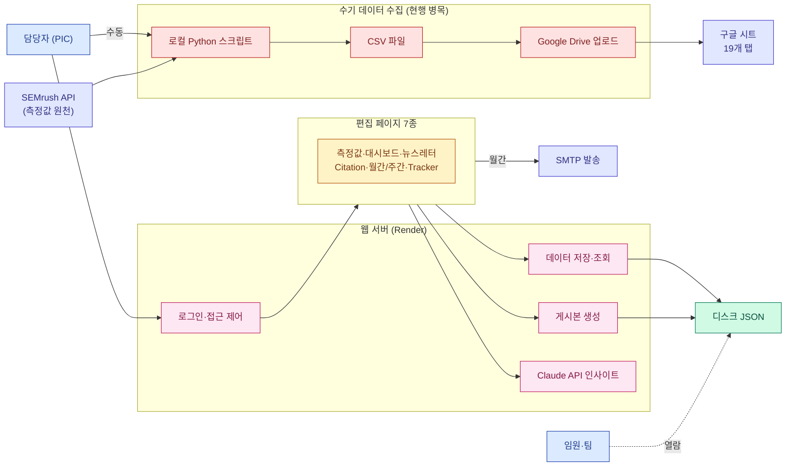
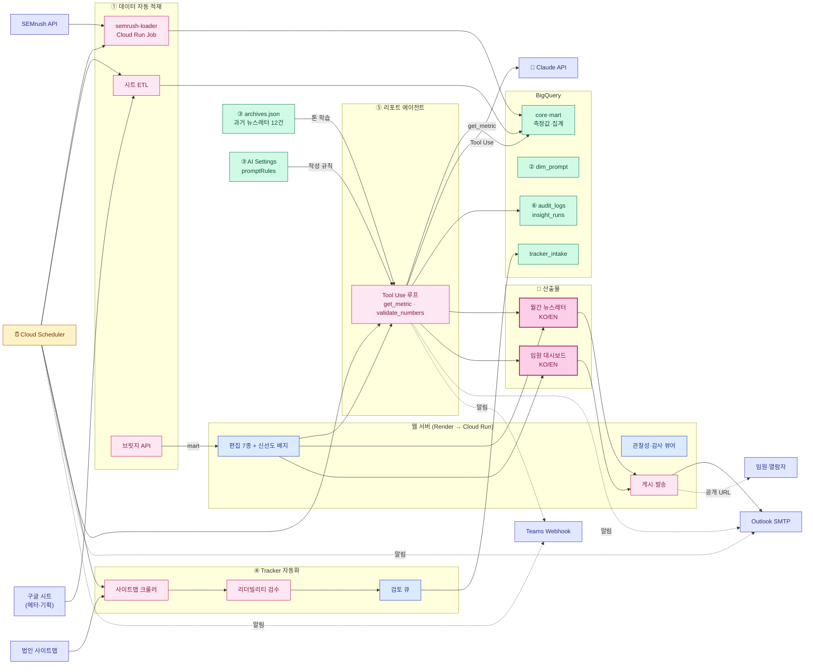

# GEO 리포팅 시스템 기획서

작성 2026-04-24 · 갱신 2026-04-28 (v19 — RAG 제거, 참조 학습으로 단순화)

비개발자 PIC가 **Claude Code + GCP** 단독으로 실행 가능한 범위로 정리한 기획서.

**구성**: §1 개요 / §2 현행 / §3 To-Be / §4 6개 축 / §5 솔로 실행 플랜 / §6 결정·범위 / §7 리스크 / Appendix

---

## 1. 개요

- LG전자 해외영업본부 D2C 마케팅팀의 **GEO(Generative Engine Optimization) 리포팅 시스템**
- ChatGPT·Perplexity 등 생성형 AI에서 LG 노출을 측정 → **월간 뉴스레터 + 임원 대시보드** 발행
- 현재 PIC 1명이 수동 운영
- **운영 모델**: 비개발자 PIC 단독 + Claude Code + GCP. dev 협업은 일회성(IAM·배포 검토)만
- **LLM 정책**: Claude API 단일. 다른 엔진 호출·교차 검증 없음
- **방향**: 데이터 자동 수집 → 근거 기반 AI 생성 → 에이전트 루프

---

## 2. 현행 시스템 (As-Is)

### 2.1 한 장 도식

### 2.2 핵심 한계

| 영역 | 한계 |
|---|---|
| **SEMrush 수집** | Python → CSV → Drive → 시트 4단계 수기, 매주 수십 분 |
| 데이터 저장 | 디스크 JSON, 이력·검색·집계 불가 |
| AI 생성 | 단발 호출, 수치 환각 위험 (이번 라운드 retry/검증/Tool Use 추가됨) |
| 과거 발행본 활용 | 12건 raw 통째 주입 — 토큰 비효율 (Prompt Caching으로 개선 가능) |
| Progress Tracker | 수동 과제 등록, 신규 콘텐츠 누락 가능 |

> 코드·보안 잔존 항목은 **Appendix A** 참고.

---

## 3. To-Be 아키텍처

### 3.1 한 장 도식

**도식 읽는 법**

- ①~⑥: §4 기능 축 (지식 허브 RAG 제거, ③은 "참조 학습"으로 대체)
- 메인 흐름 (왼쪽 → 오른쪽): SEMrush·시트·사이트맵 → BigQuery → 에이전트 → 산출물 → 임원
- **참조 학습**: `archives.json` (과거 12건) + AI Settings `promptRules`가 에이전트 컨텍스트로 직접 주입 — 별도 RAG 인프라 없음
- **시각화 산출물**(분홍 굵은 선): 동일 BigQuery + 동일 에이전트가 뉴스레터·대시보드 동시 생성, 톤·수치 자동 일치
- **LLM은 Claude API 단일** — 측정 엔진 호출이나 모델 교차 검증 없음

### 3.2 인프라 결론

- **Claude API 단일 LLM**
- **SEMrush → BigQuery 자동 적재** — `dashboard-raw-data` 레포 적재 스크립트를 Cloud Run Job 컨테이너화
- **구글 시트는 메타 전용** — 측정값은 SEMrush 자동 적재로 이원화
- **GCP 단일 플랫폼** — Cloud Run + BigQuery + Cloud Scheduler
- **참조 학습 = archives + AI Settings 규칙** — RAG 인프라 미도입. Claude의 200K 컨텍스트로 12건 직접 주입 + Prompt Caching으로 비용 절감 (§4.3)
- **단일 PIC 권한 모델** — 5롤 분리 미적용, 게시본 IP 화이트리스트로 임원 열람 통제
- **Render → Cloud Run 단계적 컷오버** — 브릿지 API로 공존
- **인프라 셋업은 click-ops** — Terraform 미사용, GCP 콘솔/gcloud + 절차서로 운영
- 고정비 **월 $30~70**, Claude API **월 $20~50** (소규모 구성 기준)

세부는 `docs/GCP_INFRA.md` / `/admin/infra` 참조

### 3.3 As-Is vs To-Be 차이

| 항목 | As-Is | To-Be |
|---|---|---|
| 측정값 수집 | 4단계 수기 (Python → CSV → Drive → 시트) | `semrush-loader` Cloud Run Job → BigQuery 자동 |
| 데이터 동기화 | "동기화" 클릭 | Cloud Scheduler 매일 새벽 + 신선도 배지 |
| 데이터 저장 | 디스크 JSON | BigQuery 단일 원천 |
| LLM | Claude 단발 호출 (래퍼) | Claude Tool Use 루프 + 수치 재검증 |
| 과거 발행본 활용 | 12건 매 호출마다 통째 주입 (비용 비효율) | 동일 12건 + **Prompt Caching** → 호출당 비용 ~90% 절감 |
| 작성 규칙 일관성 | AI Settings 텍스트 (수동 편집) | 동일 + 버전 관리 (`prompts/v1/`) |
| 프롬프트 | 시트 + 분산 화면 | BigQuery `dim_prompt` + 2단계(draft/active) |
| Tracker | 수동 등록 | 사이트맵 자동 크롤 → 검토 큐 |
| 알림 | 없음 | Outlook 이메일 + Teams Webhook |
| 뉴스레터 발송 | 수동 | 월간 자동 초안 → PIC 검토·승인 |
| 관찰성 | pino + insight_runs.jsonl (이번 라운드) | + BigQuery 이관 + `/admin/observability` |
| 감사 | 로그인 + AI 생성 | + 게시·프롬프트·설정 변경 (BigQuery `audit_logs`) |
| 인프라 | Render $7/월 | GCP $30~70/월 |
| PIC 월간 공수 | 수 시간 | 15~20분 (자동 초안 검토 중심) |

---

## 4. 6개 축

| # | 축 | 솔로 가능성 | 핵심 기술 |
|---|---|:---:|---|
| ① | §4.1 데이터 자동 적재 | 🟢 | Cloud Run Job + Cloud Scheduler + BigQuery |
| ② | §4.2 프롬프트 통합 관리 | 🟡 | BigQuery `dim_prompt` + 2단계 라이프사이클 |
| ③ | §4.3 참조 학습 (예시 + 규칙) | 🟢 | archives + AI Settings + Prompt Caching |
| ④ | §4.4 Progress Tracker 자동화 | 🟢 | Cloud Run Job + 사이트맵 크롤 + 리더빌리티 |
| ⑤ | §4.5 리포트 생성 에이전트 | 🟢 | Claude API Tool Use (시작됨) |
| ⑥ | §4.6 운영·거버넌스 | 🟡 | 감사 로그 + Outlook SMTP / Teams Webhook |

> v18 → v19: "지식 허브 RAG"를 제거하고 "참조 학습"으로 대체. RAG는 1년 후 재검토 트리거(문서 200개 초과·검색 UX 명시 요구) 시 도입.

### 4.1 데이터 자동 적재

**목적**: 4단계 수기 흐름(Python → CSV → Drive → 시트) 폐지.

| 구성 | 역할 |
|---|---|
| Cloud Scheduler | 매일 새벽 트리거 |
| `semrush-loader` Cloud Run Job | [`dashboard-raw-data`](https://github.com/mts8787-droid/dashboard-raw-data.git) 적재 로직을 컨테이너화 |
| 시트 ETL (메타 전용) | 시트의 메타·기획 탭만 BigQuery `meta_*`로 (측정값은 SEMrush 경로) |
| BigQuery 팩트·차원·마트 | Scheduled Query로 일·주·월 집계 |
| 브릿지 API | BigQuery 마트 → Render의 sync-data JSON 호환 |
| 데이터 신선도 배지 | "데이터 최신화: N시간 전" 편집 화면 상단 |

### 4.2 프롬프트 통합 관리

**목적**: 분산된 프롬프트를 BigQuery 단일 원천에 모음.

| 기능 | 설명 |
|---|---|
| 목록·필터 | 국가/카테고리/토픽/CEJ/활성 상태 |
| 조합별 대표 추출 | (국가 × 카테고리 × 토픽 × CEJ) 조합당 1개 |
| 편집·신규 | 본문·메타 수정 |
| **2단계 라이프사이클** | **draft / active** (Review/Approver 단계 생략 — 단일 PIC 운영) |
| diff·롤백 | `dim_prompt_history` append-only |
| 가져오기/내보내기 | CSV/XLSX |

### 4.3 참조 학습 (예시 + 규칙)

**핵심 결정**: RAG (벡터 검색·임베딩·VPC SC) 미도입. Claude의 200K 토큰 컨텍스트가 충분히 커서 **In-context Learning** (인컨텍스트 학습)으로 톤·문체·규칙을 직접 주입.

**구성**

| 요소 | 역할 | 현행 상태 |
|---|---|---|
| **과거 발행본 큐레이션** | `archives.json` 최근 12건을 `loadInsightContext`로 자동 주입 (Few-shot 예시) | ✅ 작동 중 |
| **작성 규칙** | AI Settings `promptRules` (PIC가 직접 편집) | ✅ 작동 중 |
| **즉석 컨텍스트** | 인사이트 생성 시 입력란에 임시 메모·발췌 붙임 (PIC 판단) | ✅ 작동 중 |
| **외부화 프롬프트** | `prompts/v1/{system.base,template,examples-only}.txt` 버전별 폴더 | ✅ 작동 중 |
| **Prompt Caching** | Anthropic API 캐시 — archives 12건 같은 큰 정적 컨텍스트를 캐시해 매 호출 비용 ~90% 절감 | Phase 1 추가 |

**왜 RAG 안 쓰나**

| RAG가 필요한 조건 | LG GEO 시스템 |
|---|:---:|
| 문서 수 10,000개+ | ❌ (50~500개) |
| 검색 기반 Q&A가 주요 UX | ❌ (월 1회 뉴스레터 작성) |
| ad-hoc 질의 빈도 높음 | ❌ |
| 사용자가 "출처 인용"을 핵심 가치로 봄 | △ (있으면 좋지만 핵심 아님) |
| PIC 암묵지가 **이미 문서화돼 있음** | ❌ (문서화 자체가 더 큰 문제) |

**RAG 도입 트리거** (1년 후 재검토)

다음 중 **둘 이상** 충족 시 §4.3 확장하여 Vertex AI Search managed RAG 추가:
- 문서 수 200개 초과
- "보고서를 검색해서 답을 받고 싶다"는 명시적 PIC 요구
- 임원이 "왜 이 인사이트가 나왔지?" 출처 추적 빈도 증가
- 분기마다 신규 보고서 5건 이상 시스템에 통합 필요

> 트리거 충족 시 1~2주 내 Vertex AI Search 인덱스 구축 가능 (이미 검토 완료된 옵션).

### 4.4 Progress Tracker 자동화

| 단계 | 동작 |
|---|---|
| ① 사이트맵 수집 | 매주 월요일 새벽 법인별 `sitemap.xml` 크롤 (Cloud Run Job) |
| ② 신규 URL 감지 | 저번 주 스냅샷과 diff |
| ③ 콘텐츠 추출 | title·h1·본문 |
| ④ 리더빌리티 검수 | Flesch-Kincaid·평균 문장 길이·전문용어 밀도 |
| ⑤ Claude 품질 코멘트 | 명확성·구조·CTA 평가 (`expensiveLimiter` 적용) |
| ⑥ 검토 큐 적재 | BigQuery `tracker_intake` |
| ⑦ PIC 리뷰 | `/admin/progress-tracker`에서 "Tracker 대상?" 체크 |
| ⑧ 자동 등록 | 체크된 URL → 과제 목록 |

> "실적 입력 담당자 롤" 제거. PIC가 모든 과제 단독 관리.

### 4.5 리포트 생성 에이전트

**Tool Use 도구 목록**

| 도구 | 효과 | 상태 |
|---|---|---|
| `lookup(path)` | 데이터 path 조회 (수치 환각 차단) | ✅ 시작됨 |
| `get_metric(category, country, period)` | BigQuery 직접 조회 | Phase 2 |
| `validate_numbers(text)` | 본문 수치 ↔ 데이터 비교 후 재생성 | Phase 1 |
| `recall_archive(period, key)` | 특정 과거 발행본 발췌 (선택, 컨텍스트 절감 시 사용) | Phase 1 (옵션) |

**이번 라운드까지 적용**
- ✅ Claude SDK retry/backoff (`maxRetries: 3` — 429·529·5xx 자동 재시도)
- ✅ 출력 검증 (빈/거절/길이 하한 → `kind: invalid_output`)
- ✅ Tool Use 루프 (최대 5회, 토큰·비용 합산)
- ✅ `lookup` 도구 (JSON path 안전 조회 + 프로토타입 오염 차단)
- ✅ `<untrusted_data>` 인젝션 방어
- ✅ `prompts/v1/` 외부화 + AI Settings 토글
- ✅ `/admin/observability` (token·비용·지연·실패 분포 시각화)

### 4.6 운영·거버넌스

**v17 → v18 변경**: "5 롤 권한" 제거. 단일 PIC 모델 유지.

| 영역 | 구현 |
|---|---|
| 권한 모델 | 단일 PIC 비밀번호 + 게시본 IP 화이트리스트 (현행 유지) |
| **감사 로그** | BigQuery `audit_logs` (append-only) — 로그인·게시·프롬프트·AI 설정 변경. `/admin/audit` 1,000건 뷰어 (`/admin/observability` 패턴 재사용) |
| **Outlook 이메일 알림** | SMTP → Exchange Online (현행 nodemailer 활용). 월간 초안 준비 / 예산 초과 / 발송 실패 |
| **Teams 채널 알림** | Incoming Webhook URL — IT부서 1회 발급 후 Adaptive Card POST. 자동 수집 실패·이상 알림 |
| OAuth 미사용 | Microsoft Graph OAuth 2.0은 dev 협업 필수 → 보류, 1년 후 옵션 |

---

## 5. 솔로 실행 플랜 (16~24주)

비개발자 PIC + Claude Code + GCP 단독 가능 영역.

### Phase 1 — 현 Render 위에서 가치 증명 (4~6주)

| 작업 | 위험 |
|---|---|
| §4.4 사이트맵 자동 크롤·인테이크 | 0 (Render 코드 추가) |
| §4.5 에이전트 도구 확장 (`get_metric`·`validate_numbers`) | 0 |
| §4.6 감사 로그 → `/admin/observability` 확장 | 0 |
| §4.3 Anthropic Prompt Caching 적용 (archives 12건 캐시) | 0 |

**산출**: 신규 콘텐츠 자동 인테이크. AI 인사이트가 도구 검증된 수치로 작성. 호출 비용 ~90% 절감.

### Phase 2 — GCP 부분 이전 (8~12주)

| 작업 | 위험 |
|---|---|
| §4.1 SEMrush → BigQuery (Cloud Run Job + Scheduler) | 중간 — 첫 GCP 컨테이너 배포 |
| 브릿지 API: BigQuery 마트 → Render JSON 호환 | 낮음 |
| §4.2 프롬프트 BigQuery 마이그레이션 (2단계) | 낮음 |
| §4.5 `get_metric` 도구를 BigQuery에 연결 | 낮음 |

**산출**: 4단계 수기 흐름 사라짐. 에이전트가 BigQuery 직접 조회. PIC 월간 공수 → 1시간 미만.

### Phase 3 — 에이전트 루프 + 알림 + 컷오버 (4~6주)

| 작업 | 위험 |
|---|---|
| 매월 1일 자동 초안 생성 (Cloud Scheduler → 에이전트) | 중간 — 비용 스파이크 모니터링 필수 |
| Outlook 이메일 알림 (이미 작동, 트리거만 추가) | 0 |
| Teams Incoming Webhook (IT 1회 발급) | 낮음 |
| Render → Cloud Run 컷오버 (선택) | 중간 |

**산출**: 자동 초안 → PIC 검토·승인 → 발송. 월간 공수 15~20분.

### dev 협업 권장 시점 (총 ~3일)

| 시점 | 사유 | 공수 |
|---|---|---|
| Phase 2 SEMrush Job 배포 후 | IAM·Secret Manager 검토 | 1일 |
| Phase 3 컷오버 시 | Cloud Run 첫 배포 검토 | 1~2일 |

> v19에서 "RAG 문서 분류 정책" 검토(1~2일) 제거 → 총 dev 시간 ~1주 → ~3일

---

## 6. 결정·범위

### 빼는 것 (v19)

| 빼는 것 | 사유 |
|---|---|
| 5롤 권한 분리 | 단일 PIC 운영 충분, 게시본 IP 화이트리스트로 임원 열람 통제 |
| **RAG 인프라 (벡터DB·임베딩·Vertex AI Search)** | LG GEO 규모(50~500문서) + 월간 뉴스레터 UX에는 over-engineering. 참조 학습으로 대체 (§4.3) |
| RAG 폐쇄망 (VPC SC + 자체 호스팅 임베딩 + Claude on Vertex) | dev 풀타임 2~3개월 수준 — RAG 자체를 빼므로 자동 제외 |
| Microsoft Graph OAuth | 앱 등록·승인이 IT 협업 필수 — Outlook SMTP + Teams Webhook으로 대체 |
| Terraform IaC | 첫 IaC 부트스트랩 학습 곡선 높음 — Cloud Console + 절차서로 대체 |
| HA / 멀티리전 | 단일 리전 (asia-northeast3) 충분 |

### 남는 것 (v19 핵심)

§4.1 SEMrush → BigQuery / §4.2 프롬프트 통합 (2단계) / §4.3 참조 학습 (archives + 규칙 + Prompt Caching) / §4.4 Tracker 자동화 / §4.5 Claude Tool Use 에이전트 / §4.6 감사 로그 + Outlook/Teams 알림 (단순 형태)

### 이번 라운드까지 진척 (코드·보안)

| 영역 | 결과 |
|---|---|
| 카파시 코드 품질 18개 항목 | 14개 + 2개 부분 = 16개 해소 (잔존 4: C1 부분·C9·C12 step3 ✅·C18) |
| 보안 15개 항목 | 11개 해소 (잔존 4: S3·S6·S11·S12) |
| 테스트 | 0 → **361개** (27 files) |
| `server.js` | 1,877 → 131줄 |
| 모듈 분리 | 14 routes / 9 lib / 6 dashboard 모듈 |
| 번들 최적화 | xlsx-js-style 동적 임포트 (-870KB JS / SPA) |
| Claude 에이전트 | retry + 출력 검증 + Tool Use 루프 + lookup 도구 |
| TypeScript | Phase 1 (allowJs + JSDoc + tsc CI) |
| 관찰성 | `/admin/observability` (KPI·시계열·실패 분포) |

---

## 7. 리스크

| 구분 | 위험 | 완화 |
|---|---|---|
| 보안 | API 키 유출 | Secret Manager + 감사 로그 (Phase 2) |
| 보안 | 프롬프트 인젝션 | `<untrusted_data>` 래퍼 + 출력 검증 (✅) |
| 품질 | AI 수치 환각 | Tool Use + `validate_numbers` 재검증 |
| 품질 | 사이트맵 누락·법인별 형식 차이 | 다중 소스 + 404 모니터링 + 법인별 파서 보정 |
| 비용 | LLM 호출 급증 | Cloud Billing 알림 (월 $300 상한) + `expensiveLimiter` (분당 30회) + Prompt Caching |
| 정합성 | 시트 ↔ BigQuery 이중 진실 | 브릿지 API로 단일 공급원 유지 |
| 마이그레이션 | 자동 적재 실패 시 fallback | 시트 수기 경로 1년간 병행 유지 |
| 운영 | 비개발자 못 잡는 미묘한 버그 ("테스트 그린 = 동작 보장 아님") | PIC 도메인 직접 테스트 + dev 1회 검토 (Phase 분기) |
| 운영 | PIC 부재 시 시스템 정지 | dev 1명 백업 절차서, 콘솔 접근 권한 사전 부여 |
| 확장성 | 보고서 누적 → 톤 학습 한계 | 1년 후 RAG 트리거 모니터링 (§4.3 트리거 조건) |

---

# Appendix

## A. 코드·보안 잔존

### A.1 카파시 관점 코드 품질

| # | 항목 | 점수 | 처리 시점 |
|---|---|---:|---|
| C1 | 에이전트성 — `lookup` ✅, `get_metric`/`validate_numbers` 잔존 | 8.3 | Phase 1·2 |
| C9 | TypeScript Phase 2 (.ts 변환) | 3.0 | 이후 라운드 |
| C18 | BigQuery 마이그레이션 | 4.5 | Phase 2 |

**해소 (참고)**: C2 라우트 분해 / C3 untrusted_data / C4 pino+insight_runs / C5 prompts/v1 / C6 상수 / C7 sanitize-html / C8 순수함수화 / C10 테스트 0→361 / C11 server.js 1877→131 / C12 step1·2·3 / C13 에러 분류 / C14 manualChunks·audit / C15 자동키 / C16 stale 메타 / C17 코드 스플릿 / C9 Phase 1

### A.2 보안

| # | 항목 | 위험 | 처리 시점 |
|---|---|---|---|
| S3 | API 키 → GCP Secret Manager | 🟠 | Phase 2 |
| S6 | Cloud Armor + `TRUST_CF_HEADER` | 🟡 | Phase 3 컷오버 |
| S11 | Memorystore Redis 세션 | 🟡 | Cloud Run 멀티 인스턴스 시 |
| S12 | `audit_logs` BigQuery 적재 (게시·프롬프트·설정) | 🟠 | Phase 1 부분, Phase 2 완료 |

**해소 (참고)**: S1 untrusted_data / S2 sanitize-html + CSP / S4 rate-limit / S5 Origin·Referer CSRF / S7 Apps Script origin / S8 게시 CSP / S9 slug 정규식 / S10 npm audit CI / S15 JSON 크기 차등

---

## B. 소스 파일 인벤토리

| 영역 | 파일·디렉터리 | 역할 |
|---|---|---|
| 진입점 | `server.js` (131줄) | 미들웨어·라우트 마운트 |
| 라우트 (16개) | `routes/{snapshots,sync,insight,email,translate,ip-allowlist,ai-settings,archives,publish,proxy,auth-api,published,spa-static,admin-pages,landing,observability}.js` | API + admin HTML |
| 라이브러리 (9개) | `lib/{storage,auth,network,sanitize,lock,insight-runs,middleware,logger,validate}.js` | I/O·인증·CIDR·sanitize·logger·Zod |
| 에이전트 | `src/shared/insightAgent.js` | Tool Use 루프 + lookup + 출력 검증 |
| 프롬프트 | `prompts/v1/{system.base,system.template,system.examples-only}.txt` | 외부화된 시스템 프롬프트 |
| 데이터 파서 | `src/excelUtils.js` | 시트 19탭 + canonicalCountry |
| 대시보드 (6개) | `src/dashboard/{template,client,svg,format,styles,consts}.js` | SSR + 인라인 클라이언트 JS 분리 |
| SPA | `src/{newsletter,visibility,citation,tracker,...}/App.jsx` | 7종 편집 페이지 |
| 테스트 | `lib/*.test.js`·`src/**/*.test.js`·`test/routes/*.test.js` | 27 files · **361 tests** (Vitest + supertest) |
| CI | `.github/workflows/ci.yml` | typecheck → test → build (7 SPA) → audit |
| 외부 레포 | [`mts8787-droid/dashboard-raw-data`](https://github.com/mts8787-droid/dashboard-raw-data.git) | SEMrush → BigQuery 적재 베이스라인 |

---

*문서 버전 v19.0 · 2026-04-28 — RAG 제거, 참조 학습으로 대체. 6개 축 → 5개 축. 도식 라벨 mermaid 호환 정리.*
