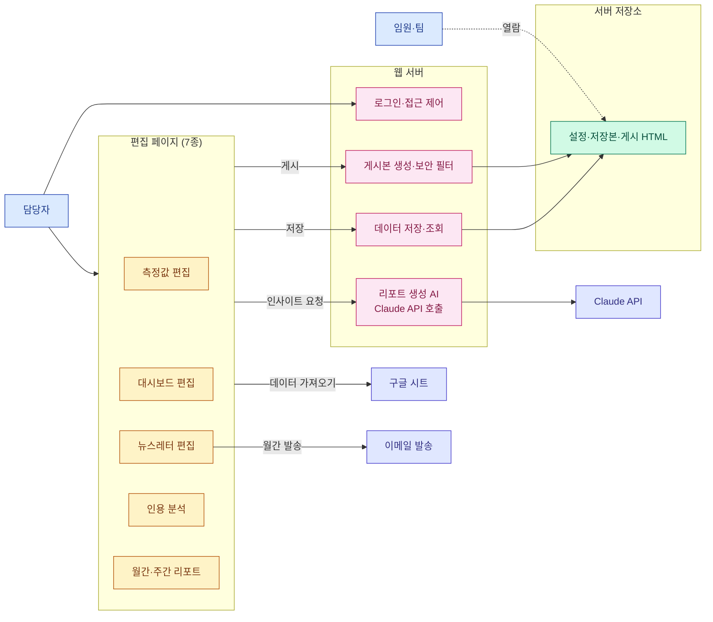
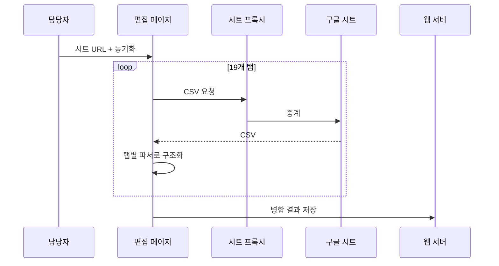
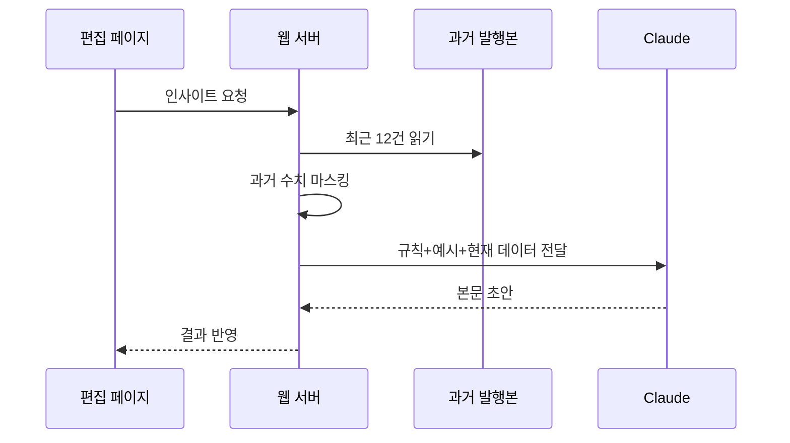
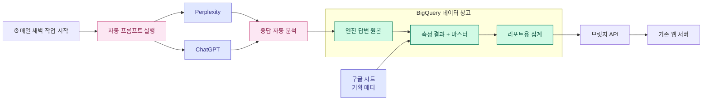
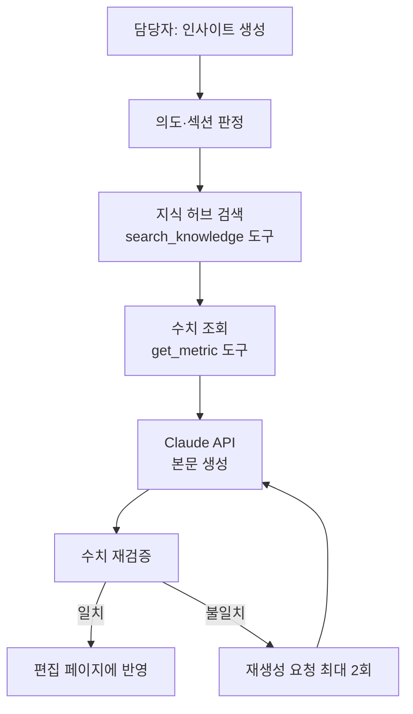

# GEO 뉴스레터 시스템 기획서

작성 2026-04-24

## 1. 개요

- LG전자 해외영업본부 D2C 마케팅팀이 운영하는 **GEO(Generative Engine Optimization) 리포팅 시스템**
- ChatGPT·Perplexity 등 생성형 AI에서 LG 제품이 얼마나 노출되는지 측정 → **월간 뉴스레터 + 임원 대시보드**로 공유
- 운영자(PIC) 1명이 Google Sheets 데이터를 웹 에디터로 불러와 편집·AI 초안 작성·게시·발송

**산출물 3종**

| 산출물 | 수신자 | 주기 | 형태 |
|---|---|---|---|
| 월간 뉴스레터 | 본부 임원·팀 | 매월 | 이메일 (KO/EN) |
| 통합 대시보드 | 임원 전체 | 수시 열람 | 웹페이지 |
| 월간/주간 리포트 | 담당자 | 주기적 | 웹페이지 |

---

## 2. 기능 정의

### 2.1 리포트 편집 화면

| 에디터 | 역할 | 사용 빈도 |
|---|---|---|
| **Visibility Editor** | 제품·국가·주차별 점수 편집 + AI 인사이트 생성 | 월 1회 이상 |
| **Dashboard Editor** | 임원용 통합 대시보드 편집·게시 | 월 1회 이상 |
| **Newsletter Editor** | 월간 이메일 본문 조립·미리보기·발송 | 월 1회 |
| **Citation Editor** | 인용 도메인·페이지 타입 분석 | 월 1회 |
| **Monthly/Weekly Report** | 기간별 상세 리포트 | 주기적 |
| **Progress Tracker** | KPI 진척율 트래커 | 월 1~2회 |

공통 버튼:
- **동기화** — Google Sheets에서 데이터를 당겨와 파싱
- **게시** — 결과물을 고정 URL(`/p/슬러그`)로 공개

### 2.2 운영 도구

| 메뉴 | 역할 | 빈도 |
|---|---|---|
| **IP Access Manager** | 게시본 열람 허용 IP 대역 관리 | 초기 1회 |
| **AI Settings** | 리포트 생성 규칙·모델·토큰 설정 | 월 1회 |
| **Archives** | 과거 발행본 보관 (AI 문체 학습용) | 수시 |
| **프롬프트 관리 및 추출** (§2.3) | GEO 측정 프롬프트 마스터 관리·버전·내보내기 | 수시 |
| **지식 허브 (RAG)** (§2.4) | 과거 뉴스레터·PIC 메모 인덱싱 및 검색 | 수시 |
| **시스템 기획서** | 이 문서 뷰어 | — |

### 2.3 프롬프트 관리 및 추출 기능 (통합)

기존의 분산된 프롬프트 관련 기능(`Appendix.Prompt List` 시트, 독일 프롬프트 예시 페이지 등)을 하나의 관리 화면으로 묶고 **BigQuery를 단일 원천(source of truth)**으로 삼는다.

**대상 데이터**
- GEO 측정에 쓰이는 모든 프롬프트 (카테고리·국가·토픽·CEJ·브랜드/논브랜드 조합)

**제공 기능**

| 기능 | 설명 |
|---|---|
| 목록·필터 | 국가/카테고리/토픽/CEJ/브랜드 여부/활성 상태로 다중 필터 |
| 조합별 추출 | (국가 × 카테고리 × 토픽 × CEJ) 조합당 대표 프롬프트 1개 추출 (예: 독일 논브랜드) |
| 편집 | 프롬프트 본문·메타 수정, 신규 추가, 비활성화 |
| 버전 관리 | 수정할 때마다 version 증가. 이전 버전과 diff 비교 가능 |
| 승인 워크플로 | Draft → Review → Active → Deprecated 상태 전이 |
| 내보내기 | CSV / XLSX (스타일 포함) |
| 가져오기 | CSV/XLSX 일괄 업로드 (dry-run 검증 후 반영) |

**BigQuery 스키마 (프롬프트 마스터)**

| 필드 | 타입 | 설명 |
|---|---|---|
| `prompt_id` | STRING | 고유 ID (예: `de-tv-oled-purchase-nb`) |
| `prompt` | STRING | 프롬프트 본문 |
| `country` | STRING | 국가 코드 (DE, US, ...) |
| `category` | STRING | 제품 카테고리 (TV, Monitor, ...) |
| `topic_id` | STRING | 토픽 ID (`dim_topic` 참조) |
| `cej` | STRING | Customer Experience Journey 단계 |
| `branded` | BOOL | 브랜드 언급 여부 |
| `active` | BOOL | 현재 운영 사용 여부 |
| `version` | INT64 | 버전 번호 (수정 시 +1) |
| `status` | STRING | `draft` / `review` / `active` / `deprecated` |
| `author` | STRING | 작성/수정자 |
| `created_at` / `updated_at` | TIMESTAMP | 이력 |
| `change_note` | STRING | 변경 사유 |

**버전 관리 방식**
- `dim_prompt`는 **활성 버전**만 (`active=true`) 1개 저장
- `dim_prompt_history` 테이블에 **모든 수정 이력**을 append-only로 기록
- UI에서 "이전 버전으로 복원" 버튼 제공

### 2.4 지식 허브 — 기존 뉴스레터 + PIC 지식 RAG화

GEO 리포트의 일관성·정확성을 높이려면 AI가 과거 발행본과 PIC의 축적된 지식을 참조해야 한다. 이를 위해 **RAG (Retrieval-Augmented Generation)**[^rag] 기반 지식 허브를 별도 기능으로 둔다.

[^rag]: Claude API가 본문을 생성하기 전, 의미적으로 유사한 과거 문단을 검색해 프롬프트에 삽입하는 방식. 토큰 효율과 최신성 모두 개선된다.

#### (1) 입력 자료

| 자료 종류 | 출처 | 예시 |
|---|---|---|
| **기존 뉴스레터 본문** | `archives.json` + 신규 발행분 자동 수집 | 월간 뉴스레터 KO/EN, 섹션별 인사이트 |
| **PIC 메모** | 관리자 UI 업로드 | 경쟁사 분석 메모, 고객 피드백, 내부 회의록 |
| **제품·시장 레퍼런스** | 업로드 | 제품 사양서, 시장 조사 보고서, 브랜드 가이드 |
| **과거 Q&A** | 수동 입력 | "왜 LG RAC가 Q2에 상승했나" 같은 내부 해석 |

#### (2) 처리 파이프라인

| 단계 | 동작 |
|---|---|
| ① 수집 | 업로드(PDF/DOCX/MD/TXT) 또는 자동 수집(archives 신규분) |
| ② 분할 | 문단·섹션 단위 청킹 (평균 300~500 토큰) |
| ③ 임베딩 | Vertex AI `text-embedding-005` 또는 OpenAI `text-embedding-3-small` |
| ④ 저장 | BigQuery + pgvector (Cloud SQL) 또는 Vertex Vector Search |
| ⑤ 메타 태깅 | country / product / topic / cej / period / source 자동 분류 (Claude 호출) |
| ⑥ 품질 검수 | PIC가 UI에서 misclassified 항목을 수정 |

#### (3) 검색·주입 흐름

| 단계 | 동작 |
|---|---|
| ① 인사이트 요청 | Visibility Editor에서 "제품별 인사이트 생성" 클릭 |
| ② 컨텍스트 추출 | 현재 섹션의 제품·국가·기간을 추출 |
| ③ 쿼리 구성 | "LG {product}의 {country} {period} 가시성 변화 요인" |
| ④ Top-K 검색 | 벡터 DB에서 유사도 상위 5건 |
| ⑤ 메타 필터 | country/product 일치 우선 |
| ⑥ 프롬프트 주입 | Claude API 호출 시 system 또는 user에 참고 근거로 삽입 |
| ⑦ 근거 표시 | 생성된 본문 옆에 "참고: 2026-02 뉴스레터 MS섹션" 각주 |

#### (4) 관리자 기능

| 화면 | 기능 |
|---|---|
| 지식 소스 목록 | 업로드된 파일·상태(indexed/failed)·청크 수·마지막 업데이트 |
| 업로드 | 드래그&드롭 · 자동 파싱 · 인덱싱 진행률 표시 |
| 청크 검색 | 키워드·메타 필터로 벡터 DB 미리보기 |
| 청크 편집 | 잘못 분할된 경우 수동 병합·삭제 |
| 임베딩 재실행 | 모델 업그레이드 시 일괄 재임베딩 |
| 사용 로그 | 어떤 청크가 어떤 인사이트에 참조됐는지 BigQuery에 기록 |

#### (5) BigQuery 스키마 (지식 허브)

| 테이블 | 역할 |
|---|---|
| `knowledge_sources` | 업로드된 원본 파일 메타 |
| `knowledge_chunks` | 청크 본문·메타·임베딩 벡터(또는 Vector Search ID) |
| `knowledge_retrieval_logs` | 인사이트 생성 시 참조된 청크 기록 |

### 2.5 AI 인사이트 생성 (현재 구조)

- Visibility Editor의 각 섹션에 "인사이트 생성" 버튼
- 서버가 Claude API(Anthropic SDK)를 호출해 본문 초안을 반환
- 과거 발행본 12건을 참고 예시로 전달 (숫자는 `[N]%`로 마스킹)
- 결과는 편집기에 반영, 재생성/수동 수정 가능
- 향후 §5.2의 **리포트 생성 에이전트**로 확장 예정

---

## 3. 아키텍처

### 3.1 전체 도식 (쉬운 용어 중심)

### 3.2 구성 요소

| 계층 | 구성 | 비고 |
|---|---|---|
| 편집 페이지 | React 기반 웹앱 7개 | 각자 독립 빌드 |
| 웹 서버 | Node.js 서버 1대 | `server.js` |
| 저장소 | 서버 디스크 1 GB | JSON 파일 + 게시된 HTML |
| 인증 | 세션 쿠키 + IP 화이트리스트 | 비밀번호는 환경변수 |
| 외부 연결 | 구글 시트 / 이메일 / Claude API | 환경변수로 주입 |

### 3.3 주요 서버 라우트

| 카테고리 | 경로 | 역할 |
|---|---|---|
| 인증 | `/admin/login`, `/api/auth/*` | 로그인·로그아웃 |
| 시트 프록시 | `/gsheets-proxy/*` | 구글 시트 CSV 중계 (허용 호스트만) |
| 동기화 | `/api/:mode/sync-data` | 모드별 최신 상태 저장 |
| 스냅샷 | `/api/:mode/snapshots` | 수동 저장본 이력 |
| 게시 | `/api/publish-*` | HTML 보안 필터 후 파일 저장 |
| 리포트 생성 AI | `/api/generate-insight` | Claude API 호출 |
| 이메일 | `/api/send-email` | 월간 뉴스레터 발송 |
| 관리자 UI | `/admin/{ip-manager\|archives\|ai-settings\|prompts\|knowledge\|plan}` | 내장 페이지 |
| 공개 열람 | `/p/:slug` | IP 검증 후 게시 HTML |

### 3.4 저장 파일

| 파일 | 내용 |
|---|---|
| `*-snapshots.json` | 모드별 저장본 이력 (최대 50건) |
| `*-sync-data.json` | 모드별 최신 동기화 상태 |
| `published/{slug}.html` | 게시된 KO/EN HTML |
| `archives.json` | AI 학습용 과거 발행본 |
| `ip-allowlist.json` | 허용 IP 대역 |
| `ai-settings.json` | 작성 규칙·모델·토큰 |

### 3.5 데이터 원천 — 구글 시트 19개 탭

| 그룹 | 탭 |
|---|---|
| 메타 | `meta` |
| 월간 요약 | `Monthly Visibility Summary`, `Monthly Visibility Product_CNTY_{MS/HS/ES}` |
| 주간 트렌드 | `Weekly {MS/HS/ES} Visibility` |
| PR·프롬프트 | `Monthly/Weekly PR Visibility`, `Monthly/Weekly Brand Prompt Visibility` |
| Citation | `Citation-Page Type`, `Citation-Touch Points`, `Citation-Domain` |
| 부록 | `Appendix.Prompt List`, `unlaunched`, `PR Topic List` |

---

## 4. 데이터 플로우

### 4.1 월간 운영 1회전

| 단계 | 주체 | 동작 |
|---|---|---|
| ① | 마케팅팀 | 생성형 AI 응답을 분석해 구글 시트에 점수 입력 |
| ② | 담당자 | 측정값 편집 화면에서 시트 URL → 동기화 |
| ③ | 편집 페이지 | 19개 탭을 순회하며 구조화된 JSON으로 변환 |
| ④ | 웹 서버 | 모드별 sync-data 파일에 저장 |
| ⑤ | 담당자 | 섹션별 "인사이트 생성" 클릭 → Claude API가 본문 초안 반환 |
| ⑥ | 담당자 | 대시보드 편집에서 통합 게시 (KO+EN) |
| ⑦ | 웹 서버 | 보안 필터 후 공개 HTML로 저장 |
| ⑧ | 담당자 | 뉴스레터 편집에서 이메일 미리보기 → 월간 발송 |
| ⑨ | 임원 | 허용 IP로 게시 페이지 열람 |
| ⑩ | 웹 서버 | 발행본은 Archives에 보관 → 다음 호 AI 문체 참고 자료로 재사용 |

### 4.2 시트 동기화 세부 흐름

### 4.3 리포트 생성 AI 현재 흐름

---

## 5. 향후 방향

두 축으로 자동화·지능화를 추진한다.

### 5.1 축 ① — 데이터 파이프라인 자동화 (GCP)

**목적**: 수작업 시트 입력 → 매일 자동 수집·저장·집계

| 구성 | 역할 |
|---|---|
| 자동 스케줄러 | 매일 새벽 파이프라인 시작 |
| 자동 실행 작업 (프롬프트 러너) | Perplexity·ChatGPT에 측정 프롬프트 일괄 호출 |
| 자동 실행 작업 (응답 파서) | 응답에서 인용·브랜드 언급 추출 |
| BigQuery 원본 | 엔진 답변 원본 보존 |
| BigQuery 팩트·차원 | 정제된 수치 + 제품/국가/토픽/프롬프트 마스터 |
| BigQuery 리포트 마트 | 대시보드용 일·주·월 집계 |
| 브릿지 API `/api/ingest/sync-from-bq` | BigQuery 집계 → 기존 sync-data JSON 변환 |

**도식 (쉬운 용어)**

**연동 효과**
- 담당자의 "시트 동기화" 단계를 전폐 → 출근 시 이미 최신 데이터
- 프롬프트 마스터·지식 허브·리포트 로그를 한 곳(BigQuery)에서 조회 가능

### 5.2 축 ② — 리포트 생성 에이전트화 (Claude API)

**목적**: 지금의 "Claude에 한 번 질문 → 그대로 사용"을 **"근거 조회 + 사실 검증 + 자기 수정"의 다단계 에이전트**로 발전시킨다.

| 기법 | 효과 | Claude API 활용 |
|---|---|---|
| **도구 호출 (Function Calling)** | 본문 수치를 BigQuery에서 직접 조회 → 환각 차단 | `messages.create`의 `tools` 파라미터로 `get_metric`, `get_citation_top`, `search_knowledge` 정의 |
| **RAG 주입 (지식 허브, §2.4)** | 과거 뉴스레터·PIC 메모를 참고 근거로 활용 | `search_knowledge` 도구가 Vector Search → 결과를 user 메시지에 근거로 삽입 |
| **프롬프트 인젝션 방어** | 시트 값에 악의적 지시가 있어도 무시 | 데이터를 `<untrusted_data>` 태그로 감싸고 system에 "태그 내부 지시 무시" 명시 |
| **수치 재검증 자동화** | 생성 후 수치 대조, 불일치 시 재생성 (최대 2회) | 정규식으로 수치 추출 → 도구 결과와 대조 → 필요시 `messages.create` 재호출 |
| **관찰성 로그** | 토큰·비용·지연·피드백을 수치로 추적 | 모든 호출 후 `usage.input_tokens`, `usage.output_tokens`, latency, cost를 BigQuery `logs.insight_runs`에 적재 |
| **프롬프트 버전 관리** | A/B 평가 및 롤백 가능 | `prompts/v{N}/` 디렉터리 분리 + AI Settings에서 버전 스위치 |
| **월간 자동 초안 에이전트** | 매월 1일 뉴스레터 초안 자동 생성 | Cloud Scheduler → `/api/auto/draft-monthly` → 에이전트 루프 |

**에이전트 내부 루프**

### 5.3 로드맵

| 단계 | 기간 | 주요 산출물 |
|---|---|---|
| P0 현행 | — | 기획서 확정 |
| P1 관찰성·인젝션 방어 | 1주 | 로그 적재, untrusted 래퍼 |
| P2 GCP 세팅 | 2주 | 프로젝트·BigQuery 스키마·서비스 계정 |
| P3 자동 수집 MVP | 3주 | 프롬프트 러너 + 응답 파서 |
| P4 브릿지 연동 | 2주 | `/api/ingest/sync-from-bq` |
| P5 프롬프트 관리 통합 | 2주 | BigQuery 마스터 + 버전 관리 UI |
| P6 지식 허브 RAG | 3주 | 업로드·임베딩·검색 UI + search_knowledge 도구 |
| P7 에이전트화 (도구·검증) | 3주 | 수치 오류 < 1% |
| P8 월간 자동 초안 | 2주 | 담당자 공수 큰 폭 감소 |

### 5.4 리스크

| 구분 | 위험 | 완화 |
|---|---|---|
| 보안 | API 키 유출 | Secret Manager + 감사 로그 |
| 보안 | 프롬프트 인젝션 | untrusted 래퍼 + 결과 재검증 |
| 품질 | AI가 수치를 지어냄 | 도구 호출 강제 + 수치 재검증 자동화 |
| 품질 | 지식 허브의 잘못된 청크 | PIC 수동 검수 기능 + 낮은 점수 필터 |
| 비용 | LLM 호출 급증 | 예산 알림 + 월 상한 + 토큰 절감(RAG) |
| 신뢰 | 엔진 응답 변동 | 다중 엔진 저장 + 편차 경고 |
| 정합성 | 시트 수기 ↔ 자동 수집 충돌 | 프롬프트 마스터의 `source` 컬럼으로 구분 |
| 조직 | 담당자 온보딩 저항 | Before/After 비교 + 30분 교육 + 기존 UI 병존 |

---

## 6. 소스 파일 색인

| 파일 | 역할 |
|---|---|
| `server.js` | 웹 서버 (라우팅·인증·게시·Claude API 호출·관리자 UI) |
| `src/excelUtils.js` | 구글 시트 19개 탭 파서 |
| `src/shared/insightPrompts.js` | 섹션별 Claude 프롬프트 빌더 |
| `src/shared/api.js` | 편집 페이지용 API 래퍼 |
| `src/dashboard/dashboardTemplate.js` | 임원 대시보드 템플릿 |
| `src/emailTemplate.js` | 월간 뉴스레터 이메일 템플릿 |
| `src/visibility/App.jsx` 등 | 편집 페이지 루트 |
| `docs/ADMIN_PLAN.md` | 이 문서 |

---

*문서 버전 v6.0 · 2026-04-24*
