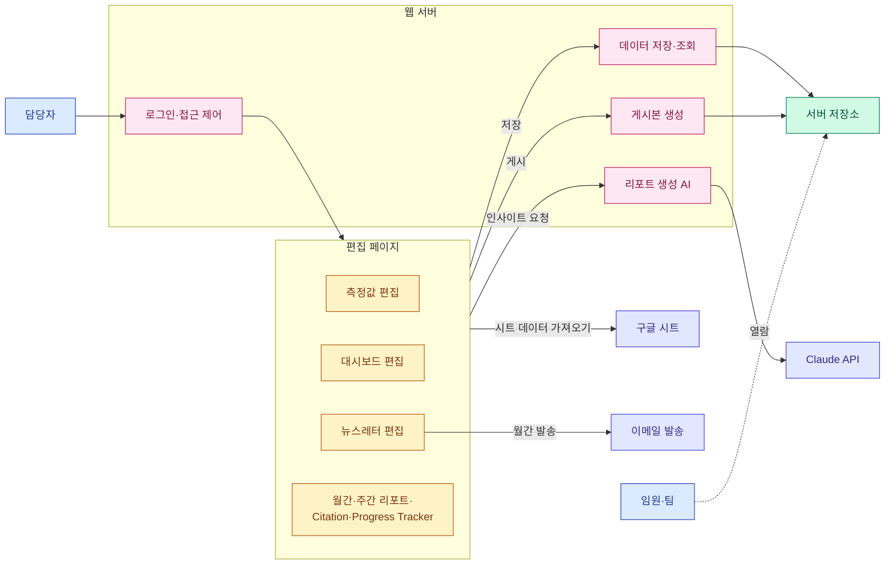
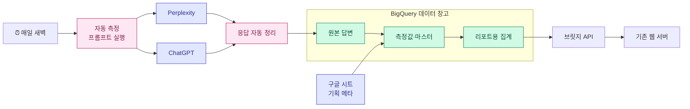
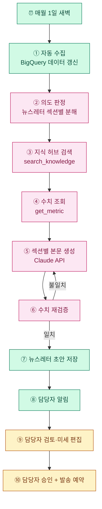

```mermaid
flowchart LR
  classDef ext fill:#E0E7FF,stroke:#4338CA,color:#312E81
  classDef run fill:#FCE7F3,stroke:#BE185D,color:#831843
  classDef store fill:#D1FAE5,stroke:#047857,color:#064E3B
  classDef ui fill:#FEF3C7,stroke:#B45309,color:#78350F

  법인[법인 사이트맵<br/>US·DE·FR·UK·...]:::ext
  크롤[사이트맵 크롤러<br/>매주 월]:::run
  diff[신규 URL 감지<br/>diff 계산]:::run
  추출[콘텐츠 추출]:::run
  가독[리더빌리티 자동 검수]:::run
  품질[Claude 품질 평가]:::run
  큐[BigQuery<br/>tracker_intake]:::store
  UI[인테이크 큐 UI<br/>담당자 체크]:::ui
  PT[Progress Tracker<br/>과제 자동 등록]:::store

  법인 --> 크롤 --> diff --> 추출 --> 가독 --> 품질 --> 큐 --> UI
  UI -- 체크된 항목 --> PT
```

# GEO 리포팅 시스템 기획서

작성 2026-04-24

이 문서는 **현행 구조를 간략히 설명하고, 향후 어떻게 개선하여 최종적으로 리포트 생성 에이전트화로 나아갈지**를 정리한다.

---

## 1. 개요

- LG전자 해외영업본부 D2C 마케팅팀의 **GEO(Generative Engine Optimization) 리포팅 시스템**
- ChatGPT·Perplexity 등 생성형 AI에서의 LG 제품 노출을 측정 → **월간 뉴스레터 + 임원 대시보드** 발행
- 현재는 운영자(PIC) 1명이 전 과정을 수동으로 수행
- 향후 방향: **데이터 수집 자동화 → AI 근거 기반 생성 → 최종 에이전트화**

**문서 구조**

| 장 | 내용 |
|---|---|
| §2 | 현행 시스템 (간략) |
| §3 | 향후 개선 방향 (5개 축) |
| §4 | 최종 비전 — 에이전트화된 시스템 |
| §5 | 로드맵 |
| §6 | 리스크 |

---

## 2. 현행 시스템 (As-Is, 간략)

### 2.1 한 장 도식 — 쉬운 용어

### 2.2 핵심 기능 목록

| 기능 | 설명 |
|---|---|
| 편집 페이지 7종 | 측정값·대시보드·뉴스레터·Citation·월간/주간 리포트·Progress Tracker |
| 구글 시트 동기화 | 19개 탭을 수동 트리거로 당겨와 파싱 |
| 게시 | 한국어/영어 HTML을 고정 URL로 공개 (IP 화이트리스트) |
| 이메일 발송 | 월간 뉴스레터를 SMTP로 수동 발송 |
| AI 인사이트 | Claude API로 본문 초안 생성 (과거 발행본 12건을 참고 예시로 전달) |
| 운영 도구 | IP 관리·AI 설정·Archives·프롬프트 예시·기획서 뷰어 |

### 2.3 현행의 한계

| 영역 | 한계 | 결과 |
|---|---|---|
| 데이터 수집 | 시트 수기 입력 + 수동 동기화 | 담당자 공수 월 수 시간 |
| 저장 | 서버 디스크 JSON 파일 | 이력·검색·집계 불가 |
| AI 생성 | 단발 호출, 수치 검증 없음 | 환각·오류 수동 교정 필요 |
| 관찰성 | 로그 수준 기록 | 비용·품질 추적 불가 |
| 프롬프트 관리 | 시트 + 몇몇 화면에 분산 | 버전·승인 체계 없음 |
| 지식 활용 | 과거 본문 raw 투입 | 토큰 낭비 + 일관성 부족 |
| Progress Tracker | 수동 과제 등록 | 신규 콘텐츠 누락 가능 |

---

## 3. 향후 개선 방향 (To-Be)

5개의 축으로 진행한다. 각 축은 독립적이지만, 순차적으로 완성되면 §4의 최종 에이전트화가 가능해진다.

| 축 | 목적 | 핵심 기술 |
|---|---|---|
| §3.1 데이터 파이프라인 자동화 | 수동 시트 입력 제거 | GCP (BigQuery, Cloud Run, Scheduler) |
| §3.2 프롬프트 관리·추출 통합 | 프롬프트를 단일 원천으로 버전 관리 | BigQuery 마스터 + 승인 워크플로 |
| §3.3 지식 허브 (RAG화) | 과거 뉴스레터·PIC 지식 활용 | 임베딩 + 벡터 검색 |
| §3.4 Progress Tracker 자동화 | 사이트맵 기반 신규 콘텐츠 자동 트래킹 | 크롤러 + 리더빌리티 + 승인 UI |
| §3.5 리포트 생성 에이전트화 | 사실 조회·검증·자기 수정 | Claude API 도구 호출 + 검증 루프 |

---

### 3.1 데이터 파이프라인 자동화

**목적**: 담당자의 "시트 동기화" 단계를 폐지. 매일 새벽 자동 수집·정리·집계.

**구성**

| 구성 요소 | 역할 |
|---|---|
| 자동 스케줄러 | 매일 새벽 파이프라인 시작 |
| 프롬프트 러너 (자동 실행 작업) | Perplexity·ChatGPT에 측정 프롬프트 일괄 호출 |
| 응답 파서 (자동 실행 작업) | 인용·브랜드 언급·도메인 추출 |
| BigQuery 원본 | 엔진 답변 원본 보존 |
| BigQuery 팩트·차원 | 정제된 수치 + 제품·국가·토픽·프롬프트 마스터 |
| BigQuery 리포트 마트 | 대시보드용 일·주·월 집계 |
| 브릿지 API | BigQuery 집계 → 기존 sync-data JSON으로 변환 |

**도식**

**효과**: 담당자가 출근하면 이미 최신 데이터 — 시트 수기 입력·동기화 단계가 사라짐.

---

### 3.2 프롬프트 관리 및 추출 통합

**목적**: 현재 분산된 프롬프트(시트 `Appendix.Prompt List` + 관리자 '독일 프롬프트 예시')를 **한 화면으로 통합**하고 BigQuery를 **단일 원천**으로 삼는다.

**기능**

| 기능 | 설명 |
|---|---|
| 목록·필터 | 국가/카테고리/토픽/CEJ/브랜드/활성 상태로 다중 필터 |
| 조합별 추출 | (국가 × 카테고리 × 토픽 × CEJ) 조합당 대표 프롬프트 1개 |
| 편집·신규 | 프롬프트 본문·메타 수정 |
| 버전 관리 | 수정 시 version 증가, 이전 버전과 diff |
| 승인 워크플로 | Draft → Review → Active → Deprecated |
| 내보내기 | CSV / XLSX (스타일 포함) |
| 가져오기 | CSV/XLSX 일괄 업로드, dry-run 검증 후 반영 |

**BigQuery 스키마 (요약)**

| 테이블 | 역할 |
|---|---|
| `dim_prompt` | 활성 버전 마스터 (country, category, topic_id, cej, branded, active, version, status) |
| `dim_prompt_history` | 모든 수정 이력 (append-only) |

---

### 3.3 지식 허브 (기존 뉴스레터 + PIC 지식의 RAG화)

**목적**: AI가 본문을 쓸 때 **과거 발행본과 PIC의 누적 지식을 의미 검색**으로 참조하게 한다.

**입력 자료**

| 종류 | 출처 |
|---|---|
| 기존 뉴스레터 본문 | `archives.json` + 신규 발행분 자동 수집 |
| PIC 메모 | 관리자 UI 업로드 (회의록·경쟁사 분석·고객 피드백) |
| 제품/시장 레퍼런스 | 사양서·조사 보고서·브랜드 가이드 업로드 |
| 과거 Q&A | "왜 DE RAC가 Q2에 상승했나" 같은 내부 해석 메모 |

**처리 파이프라인**

| 단계 | 동작 |
|---|---|
| ① 수집 | 업로드 또는 신규 발행분 자동 수집 |
| ② 분할 | 문단/섹션 단위 청킹 (300~500 토큰) |
| ③ 임베딩 | Vertex AI `text-embedding-005` |
| ④ 저장 | BigQuery + pgvector (Cloud SQL) |
| ⑤ 메타 태깅 | country/product/topic/cej/period/source 자동 분류 (Claude 호출) |
| ⑥ 품질 검수 | 관리자 UI에서 잘못 태깅된 항목 수정 |

**검색·주입 흐름**

| 단계 | 동작 |
|---|---|
| ① 인사이트 요청 | 섹션별 "인사이트 생성" 클릭 |
| ② 컨텍스트 추출 | 제품·국가·기간 자동 추출 |
| ③ 벡터 검색 | 유사도 Top-K (K=5) |
| ④ 메타 필터 | country/product 일치 우선 |
| ⑤ Claude 주입 | `search_knowledge` 도구 호출 결과를 user 메시지에 근거로 삽입 |
| ⑥ 근거 표시 | 생성 본문 옆에 "참고: 2026-02 뉴스레터 MS섹션" 각주 |

**관리자 기능**

| 화면 | 기능 |
|---|---|
| 지식 소스 목록 | 업로드 파일·인덱싱 상태·청크 수 |
| 업로드 | 드래그&드롭 + 자동 파싱 + 진행률 |
| 청크 검색 | 키워드·메타로 미리보기 |
| 청크 편집 | 수동 병합·삭제 |
| 재임베딩 | 모델 업그레이드 시 일괄 재처리 |
| 사용 로그 | 어떤 청크가 어떤 인사이트에 참조됐는지 기록 |

**BigQuery 스키마 (요약)**

| 테이블 | 역할 |
|---|---|
| `knowledge_sources` | 원본 파일 메타 |
| `knowledge_chunks` | 청크 본문·메타·임베딩 |
| `knowledge_retrieval_logs` | 참조 이력 |

---

### 3.4 Progress Tracker 자동화 (신규)

**목적**: 각 법인이 새로 만든 콘텐츠를 **놓치지 않고 트래킹 대상에 편입**하고, 게시 전후 **가독성을 자동 검수**한다.

**사용자 스토리**
> "프랑스 법인이 새 제품 페이지를 20개 올렸는데, 담당자가 일일이 찾아 Progress Tracker에 등록할 필요 없이, 매주 자동으로 신규 URL 목록이 올라오고 각 페이지의 리더빌리티 점수와 요약이 함께 보이면 좋겠다."

**동작**

| 단계 | 동작 |
|---|---|
| ① 사이트맵 수집 | 매주 월요일 새벽, 법인별 `sitemap.xml`을 크롤러가 수집 |
| ② 신규 URL 감지 | 저번 주 스냅샷과 diff → 신규/변경/삭제 분류 |
| ③ 콘텐츠 추출 | 각 신규 URL의 title·h1·본문 추출 |
| ④ 리더빌리티 검수 | 언어별 Flesch-Kincaid·평균 문장 길이·수동태 비율·전문용어 밀도 등 자동 점수화 |
| ⑤ 품질 보조 평가 | Claude API로 명확성·구조·CTA 등 정성 코멘트 |
| ⑥ 검토 큐 적재 | BigQuery `tracker_intake` 테이블에 저장 |
| ⑦ 관리자 리뷰 | 전용 UI에서 담당자가 각 URL의 **"Progress Tracker 대상 여부"** 체크 |
| ⑧ 자동 등록 | 체크된 URL은 Progress Tracker 과제 목록에 자동 편입, 메타(법인·카테고리·게시일) 기입 |

**관리자 UI — "콘텐츠 인테이크 큐"**

| 컬럼 | 예시 |
|---|---|
| URL | `https://www.lg.com/fr/tv/oled-c4-55` |
| 법인 | FR |
| 발견일 | 2026-04-22 |
| 타이틀 | OLED evo C4 55" |
| 언어 | FR |
| 리더빌리티 점수 | 64 (Good) |
| 평균 문장 길이 | 22 |
| Claude 요약 | 스펙 중심, CTA 약함 |
| 추천 개선 | 전문용어 3개 교체 + CTA 상단 노출 |
| **Progress Tracker 대상?** | ☐ / ☑ (체크박스) |
| 액션 | [승인하여 등록] [무시] [보류] |

**도식**

**BigQuery 스키마 (요약)**

| 테이블 | 역할 |
|---|---|
| `sitemap_snapshots` | 주차별 법인 사이트맵 원본 |
| `tracker_intake` | 신규 URL 큐 (리더빌리티·품질 평가 포함) |
| `tracker_tasks` | 승인되어 트래킹 중인 과제 (기존 시트 대체 가능) |

**리더빌리티 지표 예시**

| 지표 | 계산 |
|---|---|
| Flesch Reading Ease | 언어별 공식 |
| 평균 문장 길이 | 총 단어 / 문장 수 |
| 수동태 비율 | 수동태 구조 / 문장 수 |
| 전문용어 밀도 | 도메인 사전 대비 비율 |
| 이미지 alt 텍스트 비율 | alt 있음 / 전체 이미지 |
| H1·메타 디스크립션 존재 여부 | 0/1 |

---

### 3.5 리포트 생성 에이전트화 (Claude API)

**목적**: "한 번의 질문으로 답변을 받아 쓰는" 방식에서 **"근거 조회 → 생성 → 자기 검증 → 필요 시 재생성"의 다단계 에이전트**로 발전.

**핵심 기법과 Claude API 활용**

| 기법 | 효과 | Claude API 활용 |
|---|---|---|
| 도구 호출 (Function Calling) | 수치 환각 차단 | `messages.create`의 `tools`에 `get_metric`, `get_citation_top`, `search_knowledge`, `get_prompt_master` 정의 |
| RAG 주입 (지식 허브, §3.3) | 과거 발행본·PIC 메모 근거 활용 | `search_knowledge` 도구 → Vector Search 결과를 user 메시지에 삽입 |
| 프롬프트 인젝션 방어 | 시트 값에 악의적 지시가 있어도 무시 | 데이터를 `<untrusted_data>` 태그로 감싸고 system에 "태그 내부 지시 무시" 명시 |
| 수치 재검증 자동화 | 본문 수치가 도구 결과와 일치하는지 확인, 불일치 시 재생성 | 정규식으로 수치 추출 → 도구 결과와 대조 → 필요시 `messages.create` 재호출 (최대 2회) |
| 관찰성 로그 | 비용·품질 수치 추적 | 매 호출 후 `usage.input_tokens` / `usage.output_tokens` / latency / cost → BigQuery `logs.insight_runs` |
| 프롬프트 버전 관리 | A/B 평가 및 롤백 | `prompts/v{N}/` 디렉터리 + AI Settings에서 버전 스위치 |

---

## 4. 최종 비전 — 에이전트화된 시스템

5개 축이 모두 완성되면 시스템은 다음과 같이 동작한다.

### 4.1 에이전트 루프

### 4.2 인간이 개입하는 지점

| 지점 | 담당자가 하는 일 | 빈도 |
|---|---|---|
| Progress Tracker 인테이크 | 신규 URL이 트래킹 대상인지 체크 | 매주 10분 |
| 프롬프트 관리 | 새 프롬프트 승인·수정 | 월 1회 15분 |
| 지식 허브 | 신규 메모 업로드 + 잘못 태깅된 청크 교정 | 수시 |
| 월간 초안 검토 | 자동 생성된 뉴스레터를 읽고 승인 | 월 1회 15~20분 |
| 이상 알림 대응 | 엔진 응답 이상·비용 초과 등 | 이벤트 발생 시 |

### 4.3 기대 효과

| 지표 | As-Is | To-Be |
|---|---|---|
| 월간 뉴스레터 생성 공수 | 수 시간 | 15~20분 |
| 데이터 최신성 | 수동 주 1회 | 자동 매일 |
| AI 수치 오류율 | 수 % | 1% 미만 |
| 신규 콘텐츠 누락 | 발생 | 0건 (사이트맵 기반) |
| 프롬프트 이력 추적 | 불가 | 전체 버전 + 사유 기록 |
| 리포트 근거 추적 | 수동 | 각 문장마다 참조 청크 링크 |

---

## 5. 로드맵

| 단계 | 기간 | 주요 산출물 |
|---|---|---|
| P0 현행 | — | 본 기획서 확정 |
| P1 관찰성·인젝션 방어 | 1주 | 호출 로그 적재, untrusted 래퍼 |
| P2 GCP 기초 세팅 | 2주 | 프로젝트·BigQuery 스키마·서비스 계정 |
| P3 데이터 자동 수집 MVP | 3주 | 프롬프트 러너 + 응답 파서 |
| P4 브릿지 연동 | 2주 | BigQuery → sync-data 자동 변환 |
| P5 프롬프트 관리 통합 | 2주 | BigQuery 마스터 + 버전 관리 UI |
| P6 지식 허브 RAG | 3주 | 업로드·임베딩·`search_knowledge` 도구 |
| P7 Progress Tracker 자동화 | 3주 | 사이트맵 크롤러 + 리더빌리티 + 인테이크 큐 |
| P8 에이전트화 (도구·검증) | 3주 | 수치 오류 < 1% |
| P9 월간 자동 초안 | 2주 | 담당자 공수 대폭 감소 |
| P10 최종 에이전트 루프 통합 | 2주 | §4.1의 10단계 루프 상시 운영 |

---

## 6. 리스크

| 구분 | 위험 | 완화 |
|---|---|---|
| 보안 | API 키 유출 | Secret Manager + 감사 로그 |
| 보안 | 프롬프트 인젝션 | untrusted 래퍼 + 결과 재검증 |
| 품질 | AI 수치 환각 | 도구 호출 강제 + 수치 재검증 |
| 품질 | 지식 허브 오분류 | 담당자 수동 검수 + 낮은 점수 필터 |
| 품질 | 사이트맵 누락 | 다중 소스 크롤링 + 404 모니터링 |
| 비용 | LLM·크롤 호출 급증 | 예산 알림 + 월 상한 + RAG로 토큰 절감 |
| 신뢰 | 엔진 응답 변동 | 다중 엔진 병행 저장 + 편차 알림 |
| 정합성 | 시트 수기 ↔ 자동 수집 충돌 | 프롬프트 마스터의 `source` 컬럼으로 구분 |
| 조직 | 담당자 온보딩 저항 | Before/After 비교 + 30분 교육 + 기존 UI 병존 |

---

## 7. 부록 — 소스 파일

| 파일 | 역할 |
|---|---|
| `server.js` | 웹 서버 (라우팅·인증·게시·Claude API 호출·관리자 UI) |
| `src/excelUtils.js` | 구글 시트 19개 탭 파서 |
| `src/shared/insightPrompts.js` | 섹션별 Claude 프롬프트 빌더 |
| `src/shared/api.js` | 편집 페이지용 API 래퍼 |
| `src/dashboard/dashboardTemplate.js` | 임원 대시보드 템플릿 |
| `src/emailTemplate.js` | 월간 뉴스레터 이메일 템플릿 |
| `src/visibility/App.jsx` 등 | 편집 페이지 루트 |
| `docs/ADMIN_PLAN.md` | 이 문서 |

---

*문서 버전 v7.0 · 2026-04-24*
