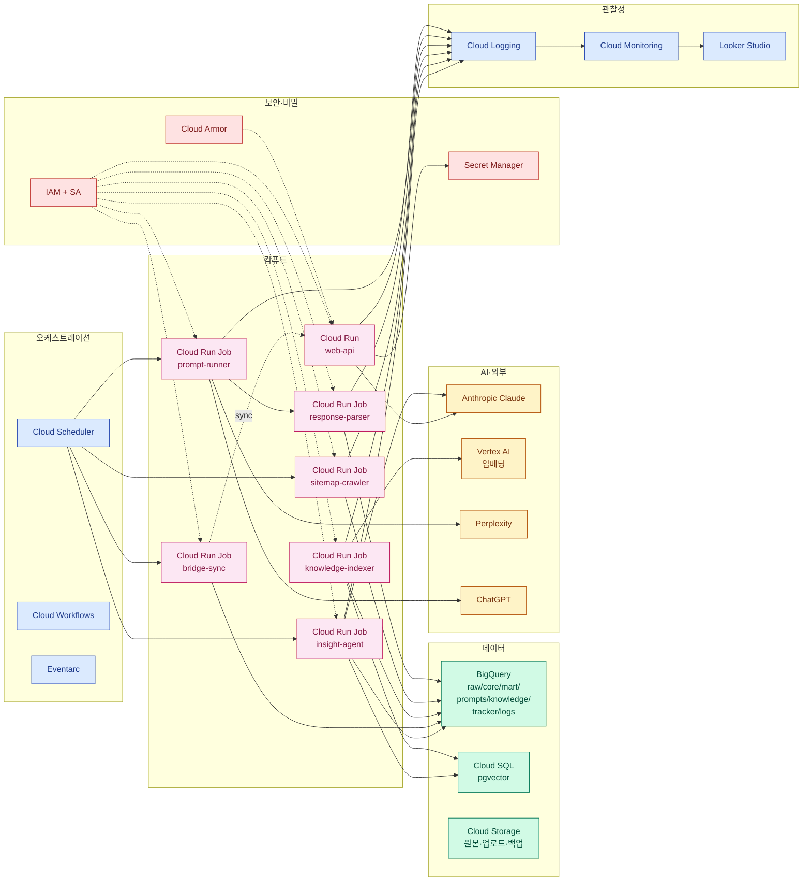

# GCP 인프라 및 서비스 구성도

작성 2026-04-24 · 본 문서는 `docs/ADMIN_PLAN.md`의 §3~5를 실제로 배포하기 위한 인프라·서비스 리스트다.

---

## 1. 개요

| 항목 | 값 |
|---|---|
| 주요 클라우드 | Google Cloud Platform (GCP) |
| 리전 | `asia-northeast3` (서울) + `us-central1` (Vertex AI 보조) |
| 기존 운영 유지 | Render (웹앱·게시본 호스팅) — 단계적 Cloud Run 이전 검토 |
| 전환 방식 | **병행 운영** → 브릿지 API → 최종 단일화 |
| IaC | Terraform (모듈화) |
| CI/CD | GitHub Actions |

---

## 2. GCP 프로젝트 구조

| 프로젝트 | 용도 | 비고 |
|---|---|---|
| `geo-report-prod` | 운영 환경 | BigQuery·Cloud Run·Secret Manager 모두 |
| `geo-report-stg` | 스테이징 | 운영과 동일 구조, 데이터만 축소 |
| `geo-report-sandbox` | 개인 실험·임시 | 예산 상한 $50/월 |

**공통**: `org-geo-report` 조직 폴더에 소속. Shared VPC 미사용(규모 작음).

---

## 3. 컴퓨트 (Compute)

| 서비스 | 사용처 | 트리거 | 예상 비용(월) |
|---|---|---|---|
| **Cloud Run Service — web-api** | Render 대체 (최종 단계, 점진 이전) | HTTPS (`geo-report.lge.com`) | $20~50 |
| **Cloud Run Job — prompt-runner** | 매일 새벽 Perplexity/ChatGPT 호출 | Cloud Scheduler | $3~8 |
| **Cloud Run Job — response-parser** | 엔진 응답에서 claim/citation 추출 | Scheduler or workflow step | $2~5 |
| **Cloud Run Job — sitemap-crawler** | 법인 사이트맵 수집·diff | 매주 월요일 | $1~2 |
| **Cloud Run Job — readability-scorer** | 신규 URL 리더빌리티 계산 | sitemap-crawler 후속 | $1~2 |
| **Cloud Run Job — knowledge-indexer** | PDF/DOCX 청킹·임베딩·BigQuery 적재 | 업로드 이벤트 or 수동 | $2~5 |
| **Cloud Run Job — bridge-sync** | BigQuery mart → Render sync-data | 매일 04:00 | $0.5 |
| **Cloud Run Job — insight-agent (선택)** | 자동 초안 생성 에이전트 | 매월 1일 06:00 | $1~3 |
| **Cloud Functions (2세대)** | 이벤트 응답 (GCS 업로드 → 인덱싱 트리거) | Eventarc | $0~1 |

> 컨테이너는 모두 **Artifact Registry**에 저장, `geo-report-prod/asia-northeast3-docker.pkg.dev/geo-report` 리포지터리.

---

## 4. 데이터 (Storage & Warehouse)

| 서비스 | 사용처 | 스키마 | 예상 비용(월) |
|---|---|---|---|
| **BigQuery `raw`** | Perplexity/ChatGPT 원본 응답 | `engine_responses` | 저장 $0.5 |
| **BigQuery `core`** | 정제된 팩트·차원 | `fact_visibility`, `fact_citation`, `dim_*` | 저장 $1 |
| **BigQuery `mart`** | 리포트용 집계 | `weekly_trend`, `country_totals`, `citation_top` | Scheduled Query $1~3 |
| **BigQuery `prompts`** | 프롬프트 마스터 + 이력 | `dim_prompt`, `dim_prompt_history` | $0.1 |
| **BigQuery `knowledge`** | 지식 허브 소스·청크·로그 | `knowledge_sources`, `knowledge_chunks`, `knowledge_retrieval_logs` | $0.5 |
| **BigQuery `tracker`** | Progress Tracker 인테이크·과제 | `sitemap_snapshots`, `tracker_intake`, `tracker_tasks` | $0.3 |
| **BigQuery `logs`** | 관찰성 (인사이트 호출·감사) | `insight_runs`, `audit_logs` | $0.5 |
| **BigQuery 조회 비용** | on-demand | — | $3~5 |
| **Cloud SQL (PostgreSQL 15 + pgvector)** | 벡터 검색 (지식 허브 청크) | 10 GB·db-f1-micro | $15~25 |
| **Cloud Storage — raw** | 엔진 원본 응답 JSON·로그 아카이브 | Coldline | $1~2 |
| **Cloud Storage — uploads** | 지식 허브 PDF/DOCX 업로드 원본 | Standard | $0~1 |
| **Cloud Storage — backups** | JSON 스냅샷·DB 덤프 | Nearline | $0~1 |

> **Vector DB 선택지**
> - **Cloud SQL + pgvector**: 간단, Terraform 1회 세팅, 소규모(수만 청크) 적합
> - **Vertex AI Vector Search**: 관리형, 대규모 확장, 비용 단계적 증가
> 초기는 pgvector, 청크 50만 건 초과 시 Vertex Vector Search 전환

---

## 5. 오케스트레이션 (Scheduling & Workflow)

| 서비스 | 사용처 |
|---|---|
| **Cloud Scheduler** | 크론 트리거 (매일 03:00, 매주 월, 매월 1일) |
| **Cloud Workflows** | 다단계 파이프라인 (prompt-runner → parser → scheduled-query) 실패 재시도·분기 |
| **Pub/Sub** | 장기 확장용 (GCS 업로드 이벤트 → 인덱싱, 실시간 알림 분기) |
| **Eventarc** | Cloud Functions 2세대 이벤트 라우팅 |

---

## 6. AI / ML

| 서비스 | 사용처 | 비용 |
|---|---|---|
| **Anthropic Claude API** (외부) | 리포트 생성·메타 태깅·품질 평가 | 호출당 과금 (§14 참고) |
| **Vertex AI — text-embedding-005** | 지식 허브 임베딩 | $0.02 / 1M 토큰 |
| **Vertex AI — Gemini (선택)** | 다중 LLM 비교 실험 | 호출당 |
| **OpenAI (선택 대안)** | `text-embedding-3-small` 폴백 | $0.02 / 1M 토큰 |

> Claude 호출은 직접 Anthropic SDK 사용. Vertex는 임베딩 전용.

---

## 7. 비밀·설정 관리

| 서비스 | 저장 항목 |
|---|---|
| **Secret Manager** | `ANTHROPIC_API_KEY`, `PERPLEXITY_API_KEY`, `CHATGPT_API_KEY`, `SMTP_PASS`, `ADMIN_PASSWORD`, `SLACK_WEBHOOK_URL`, DB 비밀번호 등 |
| **GCP IAM** | 서비스 계정별 최소 권한 원칙 |
| **환경변수** | 비민감 설정만 (예: `NODE_ENV`, 리전, 버킷 이름) |

**시크릿 접근 감사**: Cloud Audit Logs → `Admin Read`/`Data Read` 로깅 활성화.

---

## 8. 네트워크·보안

| 계층 | 구성 |
|---|---|
| **VPC** | 기본 `default` (규모상 충분). Private Service Access로 Cloud SQL 연결 |
| **Cloud Armor** | web-api Cloud Run 앞에 WAF (OWASP 규칙셋 + rate limit) |
| **Identity-Aware Proxy (IAP)** | `/admin/*` 보호 옵션 (LG SSO 연동 가능) |
| **Cloud CDN** | 게시본 정적 HTML 캐시 (선택) |
| **DNS** | Cloud DNS — `geo-report.lge.com` |
| **TLS** | Google-managed 인증서 |

---

## 9. 관찰성 (Observability)

| 도구 | 용도 |
|---|---|
| **Cloud Logging** | 구조화 로그 (pino JSON 출력) 중앙 집계 |
| **Cloud Monitoring** | 메트릭 대시보드, Uptime Check, 알림 정책 |
| **Cloud Trace** | API 요청 분산 추적 |
| **Error Reporting** | 예외 자동 그룹화 |
| **Looker Studio** | `logs.insight_runs` 시각화 (비용·품질·토큰 추이) |
| **Outlook SMTP + Teams Webhook** | 중요 알림 연동 (예산 초과·작업 실패·월간 초안 완료·실적 입력 리마인드) |
| **BigQuery `audit_logs`** | 게시·프롬프트·설정 변경 감사 |

**예산 알림**: GCP Billing Budget 월 $300 → 50%/80%/100% 단계 알림 + 100% 시 자동 API 차단 옵션.

---

## 10. 외부 서비스

| 서비스 | 용도 | 비고 |
|---|---|---|
| **Render** | 현행 웹 서버·게시본 호스팅 | 최종 Cloud Run 이전 전까지 유지 |
| **Anthropic** | Claude API (리포트 생성) | 프로젝트 API 키 별도 발급 |
| **Perplexity** | 측정 엔진 | Enterprise API 계약 필요 |
| **OpenAI (ChatGPT)** | 측정 엔진 + 폴백 임베딩 | API 키 |
| **Gmail SMTP** | 뉴스레터 발송 | OAuth2 앱 비밀번호 |
| **Outlook/Teams** | 알림 수신 | Incoming Webhook URL |
| **GitHub** | 소스 레포 + Actions CI | Private repo |
| **Cloudflare (선택)** | 글로벌 CDN·DDoS | Cloud Armor로 대체 가능 |

---

## 11. Service Account / IAM 설계

| 서비스 계정 | 최소 권한 |
|---|---|
| `sa-web-api@` | BigQuery Data Viewer, Secret Accessor, Cloud SQL Client, Cloud Run Invoker (bridge) |
| `sa-prompt-runner@` | BigQuery Data Editor (raw/core), Secret Accessor, Storage Object Creator |
| `sa-response-parser@` | BigQuery Data Editor (core), Vertex AI User, Secret Accessor |
| `sa-sitemap-crawler@` | BigQuery Data Editor (tracker), Storage Object Creator |
| `sa-knowledge-indexer@` | BigQuery Data Editor (knowledge), Cloud SQL Client, Vertex AI User |
| `sa-bridge@` | BigQuery Data Viewer (mart), Cloud Run Invoker, Secret Accessor |
| `sa-insight-agent@` | BigQuery Data Viewer (core/mart), Cloud SQL Client (knowledge), Secret Accessor |
| `sa-scheduler@` | Cloud Run Invoker, Cloud Workflows Invoker |
| `sa-ci@` (GitHub Actions) | Artifact Registry Writer, Cloud Run Deployer, Workload Identity Federation |

**키 관리**: 서비스 계정 키 파일 다운로드 금지. **Workload Identity Federation**으로 GitHub Actions 인증.

---

## 12. IaC (Terraform)

```
terraform/
├── modules/
│   ├── bigquery/          # 데이터셋·테이블·스케줄 쿼리
│   ├── cloud-run-job/     # 공통 Job 모듈
│   ├── cloud-run-svc/     # web-api
│   ├── cloud-sql/         # pgvector
│   ├── iam/               # SA + 바인딩
│   ├── secret/            # Secret Manager 리소스
│   └── scheduler/
├── envs/
│   ├── prod/
│   ├── stg/
│   └── sandbox/
└── backend.tf             # GCS 백엔드 (state)
```

- **State**: `gs://geo-report-terraform-state` (버저닝·잠금)
- **실행**: `terraform plan/apply`는 `sa-ci`가 수행 (OIDC 경유)
- **변수**: `tfvars` 분리, Secret은 Terraform이 아닌 Secret Manager에서 관리

---

## 13. CI/CD

| 파이프라인 | 트리거 | 단계 |
|---|---|---|
| **PR 검증** | PR open | lint → unit test → build → `npm audit` |
| **스테이징 배포** | main merge | Docker build → Artifact Registry push → Cloud Run deploy (stg) → smoke test |
| **운영 배포** | 수동 승인 | stg 이미지 prod 태그 → Cloud Run deploy (prod) → Looker Studio 지표 모니터링 |
| **Terraform plan/apply** | `terraform/` 변경 PR | plan 코멘트 → main merge → apply |
| **야간 보안 스캔** | Nightly | `npm audit` + `trivy`(컨테이너) + Dependabot |

**아티팩트 보존**: Docker 이미지는 최근 30일 + 태그된 릴리스만 유지 (Artifact Registry lifecycle).

---

## 14. 예상 월간 비용

**인프라 고정비**

| 항목 | 월 비용 (USD) |
|---|---|
| Cloud Run (svc + jobs) | $30~70 |
| BigQuery 저장 + 조회 | $6~10 |
| Cloud SQL (db-f1-micro + 10GB) | $15~25 |
| Cloud Storage (raw/uploads/backups) | $2~5 |
| Artifact Registry + Networking | $2~5 |
| Secret Manager | $0.6 |
| Logging·Monitoring (기본) | $0~5 |
| **인프라 소계** | **$55~120** |

**가변 API 비용 (LLM·엔진)**

| 항목 | 가정 | 월 비용 |
|---|---|---|
| Anthropic Claude (인사이트 생성) | 200 호출 × 평균 $0.02 | $4 |
| Anthropic Claude (Tool Use + 재시도) | 300 호출 × 평균 $0.015 | $5 |
| Anthropic Claude (메타 태깅) | 1,000 호출 × $0.003 | $3 |
| Perplexity (측정) | 프롬프트 300 × 국가 10 × 일 30 = 90,000 | $200~400 |
| OpenAI ChatGPT (측정) | 동일 볼륨 | $200~400 |
| Vertex AI 임베딩 | 월 10M 토큰 | $0.2 |
| **LLM·엔진 소계** | | **$400~800** |

**총합**: 초기 **월 $500 내외** → 볼륨 확대 시 **$1,000** 수준. **Budget Alert**로 월 $1,500 상한 권장.

---

## 15. 도입 순서 (체크리스트)

### Step 0 — 조직·프로젝트 준비
- [ ] GCP 조직 `org-geo-report` 생성 (또는 LG 조직 하위 폴더 할당)
- [ ] 결제 계정 연결, Budget Alert 설정
- [ ] 프로젝트 3종(`prod`/`stg`/`sandbox`) 생성
- [ ] 필요한 API 활성화 (`bigquery`, `run`, `scheduler`, `workflows`, `secretmanager`, `sqladmin`, `aiplatform`, `storage`, `artifactregistry`)

### Step 1 — 저장소·IAC 부트스트랩
- [ ] GCS 버킷 `geo-report-terraform-state` 생성
- [ ] `terraform/` 모듈 초기화, `envs/prod` 백엔드 세팅
- [ ] Artifact Registry 리포지터리 생성
- [ ] GitHub Actions OIDC Workload Identity Pool 구성

### Step 2 — 데이터 계층
- [ ] BigQuery 데이터셋 6개 생성 (`raw`, `core`, `mart`, `prompts`, `knowledge`, `tracker`, `logs`)
- [ ] 스키마 DDL 적용 (`sql/schema.sql`)
- [ ] Scheduled Query 등록 (`core → mart`)
- [ ] Cloud SQL 인스턴스 + pgvector 확장

### Step 3 — 배치·서비스
- [ ] 각 Cloud Run Job 컨테이너 이미지 빌드·배포
- [ ] Cloud Scheduler 크론 등록 (03:00, 월요일, 매월 1일)
- [ ] Cloud Workflows 파이프라인 정의
- [ ] Secret Manager에 시크릿 등록 + SA 바인딩

### Step 4 — 브릿지 연동
- [ ] Render 서버에 `/api/ingest/sync-from-bq` 라우트 추가
- [ ] Bridge Cloud Run Job이 Render로 POST
- [ ] 1주일 병행 운영 (시트 동기화 + 자동 수집 비교)

### Step 5 — 관찰성·알림
- [ ] Looker Studio 대시보드 (`logs.insight_runs` 기반)
- [ ] Cloud Monitoring 알림 정책 (작업 실패·예산·응답 이상)
- [ ] Outlook/Teams Incoming Webhook 연동

### Step 6 — 보안 강화
- [ ] Cloud Armor 규칙 적용
- [ ] `sanitize-html` 라이브러리 교체 + CSP 헤더
- [ ] `<untrusted_data>` 프롬프트 래퍼
- [ ] 감사 로그(`audit_logs`) 이벤트 적재

### Step 7 — 에이전트화
- [ ] Claude Tool Use (`get_metric`·`search_knowledge`) 구현
- [ ] Factual-Check Loop
- [ ] 프롬프트 버전 폴더(`prompts/v{N}/`) 마이그레이션
- [ ] 월간 자동 초안 Scheduler 활성화

### Step 8 — 장기
- [ ] Render → Cloud Run 이전 (DNS 컷오버)
- [ ] 메모리 세션 → Redis(Memorystore)
- [ ] 점진적 TS 전환

---

## 16. 요약 한 장



---

*문서 버전 v1.0 · 2026-04-24*
